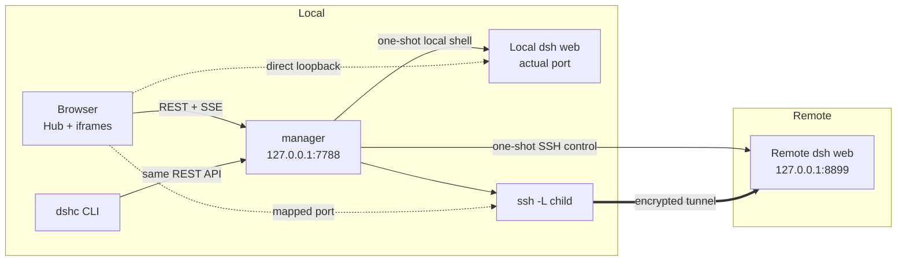

# DSH Center Handbook

[中文](HANDBOOK.md) · **English** · [Back to README](README.en.md)

This handbook carries the complete usage and maintenance details that do not belong on the
README front page. For a first run, start with the
[README quick start](README.en.md#five-minute-quick-start).

## Requirements and local/remote differences

| | Complete requirements |
|---|---|
| Manager machine | macOS or Linux. A source / git install needs **Node ≥ 22**; macOS may use a standalone bundle with its own official Node runtime |
| Managed local machine | A local DeepSeek Harness (`dsh`) installation and configured web profile are needed only if you choose to manage this machine |
| Managed remote | `dsh` installed with a web profile configured. Center probes only; it does not install or configure `dsh` |
| SSH | Remote candidates come from `~/.ssh/config`, should allow key-based login, and must not disable `AllowTcpForwarding` |

### Platform support matrix

| Platform | Install and release commitment | Verification |
|---|---|---|
| macOS arm64 (Apple Silicon) | First-class: source / git installs and a standalone Release bundle | The matching bundle is built and verified on real hardware |
| macOS x64 (Intel) | First-class: source / git installs and a standalone Release bundle | The matching bundle is built and verified on real hardware |
| Linux | Best-effort source / git installation and foreground operation; no release bundle; `dshc service` is unavailable because it requires macOS launchd | Project gates run in Ubuntu CI |

**Node 22** is the tested minimum for source / git installations. Any increase to that
minimum is announced in the [CHANGELOG](CHANGELOG.md) and the corresponding release notes.

Managing the local machine is optional. Setup offers one built-in local candidate that you may
leave unselected, and a manager may contain at most one `local:true` entry. An SSH host is never
guessed to be local just because it is named `localhost` or `127.0.0.1`.

The two host types use different transports:

- **Local:** protocol scripts run through the local shell. The browser connects directly to that
  run's actual loopback port, with no `ssh -L`, and the host never enters `degraded`.
- **Remote:** control actions are one-shot SSH commands. The page reaches a local loopback mapping
  through `ssh -L`. There is no Center agent or daemon on the host.

For both transports, Center-managed logs, patches, settings staging, and backups stay under the
target account's `~/.dsh_center_remote/`. The one exception is an explicit user save to the
resolved `${DSH_HOME:-$HOME/.dsh}/settings.yaml`.

If a target lacks `dsh` or its web profile, probing labels it "not installed / not configured"
instead of pretending it is usable. Center never installs it, but it shows actionable
installation/configuration guidance. If dsh is visible only to a login shell, probing also
reports the discovered path and non-interactive SSH PATH to help repair the environment.

## Agent Sidecar integration

[Agent Sidecar](https://github.com/shendeguize/AgentSideCar) is a downstream observation consumer
of DSH Center. Cross-repository acceptance is anchored on Agent Sidecar **v0.7.0** and the
current version of this repository. Sidecar's
[release notes](https://github.com/shendeguize/AgentSideCar/releases/tag/v0.7.0),
[security policy](https://github.com/shendeguize/AgentSideCar/blob/main/SECURITY.md), and
[Security and reporting](https://github.com/shendeguize/AgentSideCar#security-and-reporting)
section are authoritative for the Sidecar side.

### C1–C5 compatibility commitments

These are the minimum cross-repository compatibility commitments. A field, filter, transport, or
error-semantic change on either side must be recorded in issues in both repositories and reflected
in release documentation; compatibility behavior must not change silently.

- **C1: Inventory and identity.** Sidecar first reads `dshc ls --json`, then strictly falls back
  to the config/state files under `DSHC_HOME` or `~/.dsh_center`. It queries only enabled,
  non-local, non-orphaned remotes in `ready` or `no_dsh`; local rows remain in the local result,
  and remote rows carry the `host` alias supplied by DSH Center. Center does not change the
  meaning of these fields or require Sidecar to write back to Center.
- **C2: Versions and Python.** Local Sidecar installation and tooling require Python ≥ 3.9;
  **the v0.7.0 remote observation payload accepts Python ≥ 3.8 on SSH targets**. Remote
  interpreter precedence is `--remote-python` → `AGENT_SIDECAR_REMOTE_PYTHON` → the bounded
  candidate sequence. An invalid, missing, non-executable, or pre-3.8 explicit path fails closed
  for that host without trying another interpreter. Center itself continues to require Node ≥ 22
  and has zero runtime npm dependencies.
- **C3: Transport and installation.** Ordinary Sidecar `--remote` observation streams a bounded
  zipapp over noninteractive SSH, writes it to a private temporary file, runs it, and cleans it
  up. That observation path does not install Sidecar remotely, install third-party Python
  packages, or start a resident Sidecar daemon, preserving Center's remote zero-install,
  zero-resident-process contract. The task-local `bootstrap-remote.sh` is a separate, explicitly
  user-invoked orchestrator; it may place the verified Sidecar zipapp in the remote userland
  path, but is not part of the Center manager/CLI and does not change the observation path.
  Every ordinary invocation probes afresh and uses no remote cache.
- **C4: Observation semantics.** The supported commands are `list --remote`, `status --remote`,
  and `watch --all --remote`; remote JSON rows carry `host`, and human output has a host column.
  Remote failures are isolated per host and partial fleet success is allowed. Remote watch does
  not reconnect automatically; a failure must retain its warning that events may have been
  missed. Remote `send`, prefix-based remote watch, and remote message delivery are outside this
  integration.
- **C5: Failures and change handling.** `no_dsh` is Center's real probe result, not an install
  request: Center does not install `dsh`, and ordinary Sidecar remote observation does not use
  this integration to install `dsh` or Sidecar. When remote Python and SSH prerequisites are met,
  a `no_dsh` host may still be an observation candidate for Sidecar; otherwise it reports a stable
  per-host failure rather than a fabricated empty success. The independent bootstrap reports its
  userland Sidecar installation and dsh absence separately and is safe to rerun. Remote reports
  must include both versions, a sanitized host alias, the smallest reproduction, expected/actual
  behavior, and stable error codes—never credentials, paths, session content, or raw SSH data.

### Installation and remote boundary

Install Sidecar on the **local machine** using its
[installation guide](https://github.com/shendeguize/AgentSideCar#installation). Prefer downloading,
inspecting, and then running the installer from protected `main`, or use the verified v0.7.0
Release zipapp. Do not treat `pipx install agent-sidecar` as a PyPI publication guarantee. Sidecar
remote mode borrows Center's existing inventory and SSH configuration, transfers and cleans up a
one-shot payload, and leaves no installation or daemon on the target. The task-local
`bootstrap-remote.sh` is the separately documented user-invoked path when a remote dsh profile
needs a userland Sidecar installation; it never installs dsh or enables remote injection.

**No remote injection.** This downstream integration is observation-only: DSH Center and Sidecar
do not send messages to remote sessions, start a resume, invoke `send`, or turn a `no_dsh` result
into an installation or task. Agent Sidecar's `send` is a separate, explicitly authorized,
local-only write path; Sidecar's DSH injection exists only in its optional DSH plugin and is not
provided by this repository's remote inventory integration. Remote acceptance may use only a
hello-world-level non-injection check.

### Pod-local E2E plugin topology (explicit operator path)

If an operator separately deploys AgentSideCar's E2E tooling, the remote host can run the
combination `dsh web + AgentSideCar daemon + agent-sidecar DSH plugin`. In that topology:

- Center still only performs one-shot SSH control, starts/stops `dsh web`, and carries the page
  over an `ssh -L` tunnel.
- The plugin observes the daemon over the pod-local Unix socket and performs confirmed
  `inject.prepare` / `inject.execute` actions locally on the pod; messages do not pass through
  Center or the local workstation.
- Center's host `inject.env` only supplies startup environment to `dsh web` (for example PATH);
  it is not session-injection authorization and must not contain secrets.
- `scripts/deploy-to-pod.sh` belongs to AgentSideCar's operator workflow, not the Center
  installer. It handles rsync, plugin builds, daemon readiness, and the protected Copilot
  child-process environment wrapper.

Therefore, “Center does not inject remotely” and “a user-explicitly enabled Sidecar plugin can
inject locally on the pod” are separate, compatible contracts. To reproduce this topology,
record both the Center mapping state and the plugin's two-phase receipt; do not describe
Center's launch `inject` as agent-session injection.

### Reporting and cross-repository iteration

- On the DSH Center side, use the
  [cross-repo integration issue form](https://github.com/shendeguize/Remote_DSH_Center/issues/new?template=integration.yml)
  with the counterpart Sidecar issue URL, C1–C5, both versions, reproduction, and expected behavior.
- File ordinary Sidecar defects and feature requests through its
  [issue forms](https://github.com/shendeguize/AgentSideCar/issues/new/choose), after reading
  [Security and reporting](https://github.com/shendeguize/AgentSideCar#security-and-reporting).
- Do not publicly file a suspected vulnerability. Use Sidecar's
  [private vulnerability reporting](https://github.com/shendeguize/AgentSideCar/security/advisories/new)
  process, and leave only sanitized linkage in cross-repository issues.

## Installation

### One command and automatic channel selection

```bash
curl -fsSL https://raw.githubusercontent.com/shendeguize/Remote_DSH_Center/main/install.sh | bash
```

The bootstrap works whether or not Node is installed, then chooses:

| Channel | Selected when | What is installed |
|---|---|---|
| **git** | Node ≥ 22 is available (default) | Clone of the `release` branch under `~/.dsh_center/app`; `dshc` symlinks to `src/cli.js` |
| **standalone** | Node is absent or too old; automatic fallback on macOS only | Matching Release bundle, SHA256-verified before unpacking; it carries official Node and `dshc` symlinks to its launcher |

Standalone uses only the Node inside its bundle and does not touch Node on the machine. There are
no Linux standalone bundles, so Linux needs Node ≥ 22. Both channels delegate symlinking,
conflict classification, and PATH hints to `scripts/install.mjs`.

### Verify a manually downloaded bundle

If you download a `.tar.gz` manually from a GitHub Release, check `SHA256SUMS`, then use GitHub
CLI to verify the bundle's build-provenance attestation:

```bash
gh attestation verify ./dsh-center-v0.2.0-darwin-arm64.tar.gz --repo shendeguize/Remote_DSH_Center
```

### Choose a channel or version

```bash
curl -fsSL <the URL above> | bash -s -- --standalone         # force standalone
curl -fsSL <the URL above> | bash -s -- --git                # force git; fail if Node is missing
curl -fsSL <the URL above> | bash -s -- --pre                # allow pre-release versions
curl -fsSL <the URL above> | bash -s -- --version v0.1.0     # pin a Release for standalone
curl -fsSL <the URL above> | DSHC_REF=main bash              # check out main for this install only
curl -fsSL <the URL above> | DSHC_REF=v0.1.0 bash            # check out this tag for this install only
```

`DSHC_REF` selects only this installation's git checkout; it does not persist an update policy.
A later plain `dshc update` defaults back to `release`. To keep using main or a particular tag,
run `dshc update --ref main` / `dshc update --ref <tag>` explicitly, or set `DSHC_REF` again
when rerunning the installer.

Flags passed through a pipe require `bash -s --`:

```bash
curl -fsSL <the URL above> | bash -s -- --service               # also install launchd autostart
curl -fsSL <the URL above> | bash -s -- --prefix /usr/local/bin # choose the dshc symlink directory
```

For a fully manual installation:

```bash
git clone -b release https://github.com/shendeguize/Remote_DSH_Center.git ~/.dsh_center/app
cd ~/.dsh_center/app && npm run install:cli
```

Run `dshc version` afterward to see the version, installation channel, active Node, and install
directory. You can also skip installing the CLI and run `node src/cli.js <command>` from a clone.
See [install.sh](install.sh) for the bootstrap details.

## First start

```bash
dshc init
dshc up
dshc open
```

`dshc init` is a four-step wizard:

1. Choose the manager port and remote mapped-port range.
2. Set the agreed `dsh web` port.
3. Select managed hosts from the built-in local candidate and `~/.ssh/config` remotes.
4. Preview and confirm the configuration.

Step 3 probes each candidate; a slow host does not block selection. Only a `ready` probe result
may enable autostart. An unprobed or unavailable host may still be managed, but it cannot
autostart. An unselected local candidate is not written to config.

## Everyday entry points

- `#/hub` is the default entry. The `#/` root restores the last host only while it remains
  openable; otherwise it enters the Hub. Clicking the brand always returns explicitly to Hub.
- Enabled `ready / starting / running / degraded / crashed` hosts stay in the top bar. Clicking a
  `ready` tab or Hub card performs "start and enter," with an overlay showing progress.
- Switching iframe views changes visibility without reloading, preserving in-page session state.
- `#/manage` is the secondary administration page for the host table, probe-all, configuration
  reload, global defaults, events, and host details. A host menu can open its mapped URL in a new
  window.
- A local host has no tunnel to reconnect, so the UI hides or refuses meaningless reconnect
  actions.

Closing a browser tab does not stop any `dsh web`. Instances and remote tunnels belong to the
manager, not the browser lifecycle.

## States and self-healing

Each host moves through eight phases:

```text
unknown → unreachable / no_dsh / ready          (three probe outcomes)
ready   → starting → running                    (start)
running → degraded → running                    (remote tunnel drops and recovers)
running → crashed → starting → running          (manual restart after process death)
```

- A remote tunnel drop becomes `degraded` and reconnects with 1/2/4/8/16/30-second backoff. If
  forwarding is explicitly forbidden (`AllowTcpForwarding=no`), retries suspend instead of
  looping pointlessly.
- Every 30 seconds, a sweep first sends a minimal HTTP request through the local mapping and
  **requires bytes back**. A TCP connect alone gives false health because SSH may keep accepting
  after the remote process dies. On failure, a deep SSH verification distinguishes a genuinely
  dead process (`crashed`) from a live process that only needs a fresh tunnel child.
- A manager restart **does not relaunch managed processes**. It verifies fingerprints and adopts
  surviving instances, rebuilding remote tunnels or re-registering local direct connections.
- Local hosts reuse HTTP probing and fingerprint verification but have no transport to rebuild.
  A dead process becomes `crashed`; a matching live process with a temporarily unresponsive port
  stays `running` for another sweep instead of inventing `degraded`.

## Configuration and data

Every runtime parameter comes from `~/.dsh_center/config.json`. `DSHC_HOME` relocates the whole
directory; the code contains only one factory-default table, `src/defaults.js`.

```text
~/.dsh_center/
  config.json    # only config source: manager, agreed ports, mapped range, per-host transport/switches/injection
  state.json     # pid, port, fingerprint, tunnel/direct connection, patch records; safe to delete
  manager.log    # event log; long SSH stderr and similar text uses indented continuation lines
  manager.pid
  app/           # code installed by the one-click script; a manual clone may live elsewhere
```

Each host has an optional `local` identity. Older configs without it are treated as `false` (SSH)
and do not need setup again. A local entry requires `localPort: null`, and there may be at most
one. It uses the actual web port and does not consume the remote mapped-port pool.

The factory-agreed `dsh web` port is 8899. If occupied, the launcher falls back to `--port 0` and
lets the target OS assign one. A remote then gets a stable local mapping from the configured
range; a local host uses the actual port directly.

Host-level settings and injection take effect on the **next start** and never modify a running
instance. Changing `manager.port` only writes config; `dshc restart` is required to move the
listener.

### Launch directory and dsh Workspace

`hosts.<host>.workdir` sets the target `dsh web` process working directory. It is also the
fallback for a new session with no explicit Workspace/cwd and the location from which
`AGENTS.md` is loaded:

```bash
dshc config set hosts.gpu-1.workdir '~/projects/foo'
```

An empty string or `null` clears it to the target account's home. Only an absolute path, `~`, or
`~/…` is accepted; that account expands `~`. If the directory cannot be entered, start fails
loudly instead of silently falling back to home.

A workdir is not automatically registered as a dsh Web Workspace and does not replace a
historical session restored by the browser. Once the directory is active and the instance is
connected, use **Register launch directory as Workspace** in the host detail's **dsh Workspace**
section. Center calls dsh Web's official `workspace.create` API through the local mapping.
Repeated registration is idempotent and does not modify the remote dsh CLI or `HOME`. dsh Web's
own directory picker still starts from the target account's `HOME` under its upstream rules.

Saving workdir never disturbs the current instance. Restart that host's `dsh web`; restarting
only the manager does not change the working directory of a surviving process.

### Editing the dsh configuration file

An `ssh -L` mapping brings a page to the local browser, not the remote desktop capability. The
remote dsh Web "Open configuration file" action still calls a desktop opener on the target.
For a headless Linux host, use the **dsh configuration file** section in host details to read and
edit `${DSH_HOME:-$HOME/.dsh}/settings.yaml` over SSH. A local entry uses the equivalent local
transport.

Center treats the file as opaque UTF-8 and never parses or rewrites YAML, avoiding dependence on
dsh's current schema. The body flows only through one-shot command stdin/stdout: reads return
reversible hex over stdout, and saves send the body over stdin. Reads and writes are each limited
to 512 KiB. Before save, a checksum detects another editor's changes; Center then makes a backup
and atomically replaces the file.
On conflict or an unknown save result, the page asks for a reload and preserves the old draft
for manual merging. dsh watches and reloads this file itself; Center does not modify the dsh CLI
or restart the instance.

## Security boundary

This tool is designed as a **single-user desktop tool on a trusted network**:

- The manager binds `127.0.0.1` and has **no authentication**. Anything that can run code locally
  can drive it, including the managed local instance and remotes reached through tunnels.
  **Never bind it to `0.0.0.0` or forward its port to the public internet.**
- Loopback binding does not stop a browser from making requests for someone else. A request with
  `Origin` must use the manager's own origin, and `Host` must be a loopback name. The latter
  blocks an attacker domain resolving to `127.0.0.1` and placing the page in its origin. The CLI
  sends no `Origin` and is unaffected.
- The remote data plane is `ssh -L`; encryption and authentication come from SSH configuration
  and keys. The local data plane connects directly to loopback.
- A dsh configuration file may contain credentials. Its body exists briefly in manager/browser
  memory and one-shot command stdin/stdout (reads use reversible hex), and is never written to
  manager config, logs, or SSE. Do not share the manager page or browser session with untrusted
  users.
- Apart from an explicit **Save file** action, managed-side artifacts stay under
  `~/.dsh_center_remote/` in that account's HOME (logs, patches, settings staging, and one
  backup). Explicit save may write only the resolved
  `${DSH_HOME:-$HOME/.dsh}/settings.yaml`; the API accepts no arbitrary path. **Local** patch
  sync shares `patches/` with user files and refuses to remove an existing file whose ownership
  it cannot prove. The remote `~/.dsh_center_remote/patches/` is Center-managed, so remote sync
  removes files no longer referenced by configuration. Both patch destinations remain confined
  to that managed directory.
- Injected environment variables and extra arguments appear verbatim on the target command line
  and are visible to `ps`; **never put secrets there**.
- **Never killing the wrong process is a hard boundary.** Before local or remote stop, Center
  compares the recorded `ps` command-line fingerprint verbatim. Manual instances are read-only,
  and a mismatch refuses the kill. The worst case is failing to stop the intended process, not
  stopping somebody else's.

## Command quick reference

```text
Lifecycle: dshc init / up / down / restart / status / logs / service install|uninstall|status
Itself:    dshc version / update      # version --json; update --pre / --ref <branch|tag> / --restart
Hosts:     dshc ls / probe / start / stop / reconnect / log / open / config
Exit codes: 0 success | 1 operation failed | 2 timeout/communication failure | 3 usage error | 130 Ctrl-C interrupted the wait (operation continues)
```

`dshc --help` prints complete usage. `DSHC_SSH_CONFIG` selects a different SSH config.
`dshc service install` writes a launchd plist whose KeepAlive restarts a killed manager. Linux
does not support that command; write a systemd unit targeting `dshc up --foreground`.

## FAQ

**Does it work on Linux?** Source / git installation and foreground operation are supported
on a best-effort basis, with project gates running in Ubuntu CI. There is no Linux release
bundle. `dshc service` is unavailable because it requires macOS launchd; for autostart,
write a systemd unit pointing at `dshc up --foreground`.

**What if a local or remote target has no dsh?** Probe labels it "not installed / not configured"
and distinguishes a missing binary from a missing web profile. It shows installation/configuration
guidance but installs nothing and will not allow an accidental start. If a login shell can find dsh
while non-interactive SSH cannot, the diagnostic appears in the details.

**Will it stop a `dsh web` that someone started manually?** No. Manual instances are shown as
"🔒 manual" and read-only; `stop` and `restart` are refused. A fingerprint mismatch never kills.

**Can the remote's `X-Frame-Options` block the iframe?** In practice, dsh web sets no such header.
The initial loading state only means waiting and cannot diagnose a cross-origin failure. If
embedding is blocked, use **Open in a new window** from the host menu.

**Must the manager restart after a config change?** Host-level settings apply on next start.
Changing `manager.port` requires `dshc restart`, and the page says so explicitly.

**Does closing the browser stop an instance?** No. Stop explicitly with `dshc stop <host>`.
`dshc down` closes only the manager and transport resources; it **does not stop managed
`dsh web` processes as a side effect**.

## Upgrading

Re-running the one-click installer upgrades in place, or use:

```bash
dshc update              # update to the latest stable release on the installation channel
dshc update --pre        # allow a pre-release version
dshc update --restart    # restart the manager afterward; default is only a reminder
```

- For a **git install**, plain `dshc update` defaults to `origin/release`. Only an explicit
  `dshc update --ref main` / `--ref <tag>` selects another target, for that update only. Updates
  are fast-forward only: a dirty working tree or a target that is not a descendant is refused,
  and local changes are never overwritten by a merge. Example rollback:
  `git -C ~/.dsh_center/app checkout v0.1.0`.
- A **standalone install** writes only after SHA256 verification, switching with "unpack to
  `.new` → atomic rename." The previous release remains at `~/.dsh_center/app.prev` and can be
  moved back.

See [CHANGELOG.md](CHANGELOG.md) for release changes.

## Full uninstallation

First stop the service and manager in this safe order:

```bash
dshc service uninstall  # 1. if launchd autostart was installed
dshc down               # 2. stop the manager and tunnels
```

Then invoke the installed channel's own uninstaller to remove the link; choose one:

```bash
# Default git path: use the system Node
node ~/.dsh_center/app/scripts/install.mjs --uninstall

# Default standalone path: use the bundled Node
~/.dsh_center/app/runtime/bin/node \
  ~/.dsh_center/app/app/scripts/install.mjs --uninstall
```

If installation used a custom `--prefix`, pass the same `--prefix` during uninstall. If the app
root was customized, replace the script and bundled-Node paths accordingly. Do not blindly `rm`
the link instead of using the installer. After unlinking, remove manager data:

```bash
rm -rf ~/.dsh_center
```

Removing manager data does not remove managed-side directories. Local logs and patches may
remain in `~/.dsh_center_remote/`, and remotes are the same. Confirm that relevant instances have
stopped, then clean each host:

```bash
rm -rf ~/.dsh_center_remote
ssh <host> 'rm -rf ~/.dsh_center_remote'
```

If `dsh web` is still running, stop it from the management page or with `dshc stop <host>`.
The last-resort `ssh <host> 'pkill -f "dsh web"'` **does no fingerprint verification and will
also kill other people's matching instances**. It is substantially riskier than `dshc stop`;
use it with extreme care.

## Architecture details



- **The manager is the single source of truth.** An iframe uses the `mappedUrl` returned by the
  manager; the frontend neither copies default ports nor guesses runtime parameters.
- **Control and data planes are separate.** Control is REST/SSE followed by the same protocol
  through local shell or one-shot SSH. The browser connects pages, assets, and WebSockets
  directly to the actual or mapped port; the manager does not proxy data.
- **Only SSE advances state.** Buttons do not optimistically mutate phases; the UI waits for
  `host-changed` and `operation-done`.
- **Remote compatibility is end to end.** Probe, launch, sweep, fingerprint verification, stop,
  and logs all use one-shot protocol commands, with nothing installed or kept resident.

## Development and real-machine acceptance

Runtime and tests have zero npm dependencies, so there is no `npm install` step.

```bash
npm run check                    # complete gate
npm run check -- --only tests    # select gates; also --skip ui / --require-browser / --list
npm test                         # unit, fake-remote integration, CLI e2e, frontend, tooling, install.sh
npm run coverage                 # coverage report
npm run coverage:gate            # overall and tiered coverage gate
npm run matrix:gate              # behavior inventory vs coverage matrix; -- --suggest lists candidate tests
npm run perf:gate                # wall-clock baseline (soft gate); -- --record re-records, -- --advisory warns only
npm run mutation:gate            # mutation testing (weekly gate); -- --tier lib --only shq.js for a fast single file, -- --list to preview
npm run ui:smoke                 # real-browser smoke in headless Chrome
npm run journey:check            # executable journeys, behavior IDs, and generated checklist
npm run journey:write            # regenerate tests/ACCEPTANCE_JOURNEYS.md from the spec
```

Site and demo:

```bash
npm run site:dev      # build _site/ and serve it at http://127.0.0.1:4321
npm run site:build    # build only; _site/ is not committed
npm run site:shots    # generate the interface shots used by README and landing
npm run site:check    # site build, demo smoke, bilingual README links and commands
```

The live demo has `site/demo/demo-shim.js` override `window.fetch` and `window.EventSource` and
route them to an in-browser fake manager; state transitions reuse `src/lib/machine.js`.
`src/web/**` has no demo-specific modification, so drift makes the check fail directly.

Tests never touch real machines. `tests/harness/` supplies fake SSH/SCP, local-shell and dsh-web
shims, a state engine, 15 remote fault scenarios, and the full local flow. Real-machine
acceptance is an explicit operator action:

```bash
npm run acceptance:real -- --host <ssh-host>                        # IT-01…13
npm run acceptance:smoke -- --host <ssh-host>                       # shortest loop; unreachable is a warning
npm run acceptance:real -- --host <ssh-host> --only IT-06,IT-09 --keep
```

Every real-machine run rescans `~/.ssh/config` first and uses an exclusive lock for the target host.
An unreachable host in smoke mode produces warning evidence without blocking; an unreachable host in
the full tier blocks release. Results are sanitized JSON plus Markdown under `.local/evidence/` and
are compared with the previous run. `scripts/bootstrap-remote.sh` is an operator script, not a
Center product path: it may install only zstd and userland Sidecar when authorized, never dsh or
Python. To verify the bootstrap itself, run `bash scripts/bootstrap-remote.sh --deep <ssh-host>`,
then run the normal bootstrap and acceptance again.

The five-agent Sidecar/plugin matrix is a separate operator entry point and is never triggered by
`npm test`:

```bash
npm run acceptance:matrix -- --host <ssh-host> --timeout 180000 --parallel 2
npm run acceptance:matrix -- --fixture
npm run acceptance:matrix -- --dry-run
```

The matrix defaults to `claude,codex,copilot,kimi,dsh`. A real run performs a fresh SSH scan,
reuses the Center tunnel to read pod-local plugin state, and checks the real
`inject.prepare` → `inject.execute` receipt. `--parallel`, `--timeout`, `--remote-dir`, and
`--report-dir` are bounded. Evidence keeps only the agent, a redacted session hash, states,
delivery, outcome, and error code; it does not retain messages, confirm tokens, credentials,
complete session IDs, or raw paths. Kimi `delivery=unknown` is terminal and is never retried;
`dsh_preset_unsupported`/HTTP 409 for a persisted DSH preset is recorded honestly. Fixture and
dry-run modes validate orchestration only and never count as a real pass.

CI runs required `npm run check` on Ubuntu for pull requests and repeats it on macOS after a
merge to main. Ubuntu includes Chrome, so the browser gate must run. macOS may skip it when
Chrome is absent; use `DSHC_CHROME=<path>` to select a browser locally.

Code map: `src/lib/` is the pure kernel; `src/*.js` is the
store/ports/prober/launcher/tunnel/monitor/API/server/CLI/daemon module layer; `src/web/` is the
native ESM frontend; and `site/` is the landing page plus live demo. See
[tests/COVERAGE_MATRIX.md](tests/COVERAGE_MATRIX.md) for coverage ownership,
[CONTRIBUTING.md](CONTRIBUTING.md) for collaboration and release rules, and
[AGENTS.md](AGENTS.md) for hard constraints before changing code.
