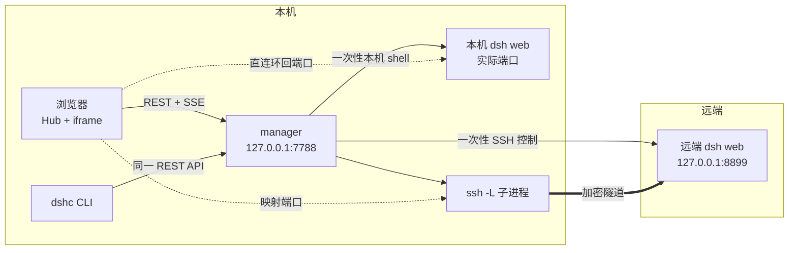

# DSH Center 使用手册

**中文** · [English](HANDBOOK.en.md) · [返回 README](README.md)

本文承接 README 之外的完整使用与维护细节。先快速体验请从
[README 的 5 分钟上手](README.md#5-分钟上手)开始。

## 前提与本机/远端区别

| | 完整要求 |
|---|---|
| manager 本机 | macOS 或 Linux。源码 / git 安装需要 **Node ≥ 22**；macOS 可改用自带官方 Node 的 standalone 发布包 |
| 受管本机 | 只有选择纳管本机时，才需要在本机安装 DeepSeek Harness（`dsh`）并配置 web profile |
| 受管远端 | 已安装 `dsh` 并配置 web profile。Center 只探测，不负责安装或配置 `dsh` |
| SSH | 远端候选来自 `~/.ssh/config`，应可免密登录；远端不得禁用 `AllowTcpForwarding` |

### 平台支持矩阵

| 平台 | 安装与发布承诺 | 验证 |
|---|---|---|
| macOS arm64（Apple Silicon） | 一等支持：源码 / git 安装与独立 Release 发布包 | 对应架构发布包会构建并实机验包 |
| macOS x64（Intel） | 一等支持：源码 / git 安装与独立 Release 发布包 | 对应架构发布包会构建并实机验包 |
| Linux | 源码 / git 安装与前台运行按 best-effort 支持；不提供发布包；`dshc service` 依赖 macOS launchd，因此不可用 | Ubuntu CI 跑通项目闸门 |

源码 / git 安装以 **Node 22** 为经过测试的最低版本。若提高最低版本，会在
[CHANGELOG](CHANGELOG.md) 与对应 Release notes 中提前说明。

本机纳管是可选的。setup 会提供一个内置本机候选，可不勾选；一台 manager 最多有一个
`local:true` 条目。名称是 `localhost` 或 `127.0.0.1` 的 SSH 主机不会被猜成本机。

两类主机使用不同运输方式：

- **本机**：协议脚本交给本机 shell；浏览器直连当次 `dsh web` 的实际环回端口，不创建
  `ssh -L`，不会进入 `degraded`。
- **远端**：控制动作是单条一次性 SSH；页面经 `ssh -L` 映射到本机环回端口。远端没有
  Center agent 或守护进程。

两类运输都把 Center 管理的日志、patch、settings staging 与备份放在目标账户的
`~/.dsh_center_remote/`。用户明确保存 dsh 配置时，唯一例外是写入解析后的
`${DSH_HOME:-$HOME/.dsh}/settings.yaml`。

任一目标缺少 `dsh` 或 web profile 时，探测会明确标为“未安装/未配置”，不会假装可用，
也不会代为安装；Center 会展示可复制的安装/配置指引。若 dsh 只在 login shell 可见，
还会报告嗅探到的路径与非交互 SSH PATH，帮助修正环境。

嗅探不止看非交互 PATH：常见安装目录（含 canon 的 `~/.canon/node/bin`）逐个试，
再退到 login shell，最后退到交互 shell —— 装在 `~/.bashrc` 里的 PATH 只有交互 shell
看得见。解析出的 `dsh` 常是 `#!/usr/bin/env node` 脚本，解释器与它同住一个 bin 目录，
故版本探测与拉起都会先把该目录并入 `PATH`。

## Agent Sidecar 集成

[Agent Sidecar](https://github.com/shendeguize/AgentSideCar) 是 DSH Center 的下游观察消费者。
两库联合验收以 Agent Sidecar **v0.7.0** 与本仓库当前版本为锚；Sidecar 的
[版本说明](https://github.com/shendeguize/AgentSideCar/releases/tag/v0.7.0)、
[安全策略](https://github.com/shendeguize/AgentSideCar/blob/main/SECURITY.md) 与其仓库的
[Security and reporting](https://github.com/shendeguize/AgentSideCar#security-and-reporting)
章节是 Sidecar 一侧的权威约束。

### C1–C5 兼容承诺

这是跨仓库集成的最小兼容契约。改动任一边的字段、筛选、运输或错误语义，都要在双方
仓库开 issue 留痕并更新版本说明；没有明确迁移说明，不得把兼容行为当成实现细节。

- **C1：清单与身份。** Sidecar 优先读取 `dshc ls --json`，不可用时严格回退到
  `DSHC_HOME` 或 `~/.dsh_center` 下的配置/状态文件。它只查询启用、非本机、非孤儿且处于
  `ready` 或 `no_dsh` 的远端；本机行仍保留在本地结果中，远端结果带 DSH Center 提供的
  `host` 别名。Center 不改变这些字段的含义，也不要求 Sidecar 反向写入 Center。
- **C2：版本与 Python。** Sidecar 本机安装和工具链要求 Python ≥ 3.9；**v0.7.0 的
  远端观察 payload 接受 SSH 目标上的 Python ≥ 3.8**。远端解释器按
  `--remote-python` → `AGENT_SIDECAR_REMOTE_PYTHON` → 有界候选序列选择；显式路径无效、
  缺失、不可执行或低于 3.8 时该主机 fail closed，不回退到其他解释器。Center 自身仍要求
  Node ≥ 22，主体运行时零 npm 依赖。
- **C3：运输与安装。** Sidecar 的普通 `--remote` 观察把有界 zipapp 经非交互 SSH
  流入目标，写入私有临时文件，执行后清理；该观察路径不在远端安装 Sidecar、不安装
  第三方 Python 包、不启动 Sidecar 常驻守护进程，也不改变 Center 的远端零安装、零常驻
  承诺。任务内的 `bootstrap-remote.sh` 是用户显式调用的独立编排脚本，才会把已验证的
  Sidecar zipapp 放入远端用户态路径；它不属于 Center manager/CLI，也不改变上述观察路径。
  每次普通远端调用重新探测，不依赖远端缓存。
- **C4：观察语义。** 支持 `list --remote`、`status --remote` 与
  `watch --all --remote`；远端 JSON 行带 `host`，人类输出带主机列。远端观察按主机隔离
  失败，允许部分成功；watch 不自动重连，失败后必须保留“可能丢事件”的警告。远端
  `send`、按会话前缀 watch 与远端消息投递不属于本集成。
- **C5：失败与变更。** `no_dsh` 是 Center 的真实探测结果，不是安装请求：Center 不会
  代装 `dsh`；普通 Sidecar 远端观察也不会借此安装 `dsh` 或 Sidecar。满足远端 Python 与
  SSH 条件时，`no_dsh` 主机仍可作为 Sidecar 的观察候选；不满足时按主机报告稳定失败码，
  不伪造空成功。独立 bootstrap 的用户态 Sidecar 安装与 dsh 缺失提醒分别回显、可幂等重跑。
  远端问题须附两边版本、目标主机的脱敏别名、最小复现、期望/实际行为及稳定错误码，
  不附凭据、路径、会话内容或原始 SSH 数据。

### 安装与远端边界

Sidecar 按其 [安装说明](https://github.com/shendeguize/AgentSideCar#installation) 在**本机**
安装；推荐下载、检查并执行受保护 `main` 上的安装脚本，或使用已验证的 v0.7.0 Release
zipapp。不要把 `pipx install agent-sidecar` 当作 PyPI 发布承诺。Sidecar 的普通远端模式只
借用 Center 的既有清单与 SSH 配置，一次性传输并清理 payload，不在目标机留下安装物或
守护进程。若远端 dsh web profile 需要用户态 Sidecar 安装，使用任务内独立的
`bootstrap-remote.sh`；它不属于 Center manager/CLI，不安装 dsh，也不打开远端注入。

**远端不注入。** DSH Center 与 Sidecar 的这条下游集成只有观测面：不会向远端会话发送消息、
启动 resume、调用 `send`，也不会通过 `no_dsh` 状态触发安装或任务。Agent Sidecar 的
`send` 是独立的本机、显式授权写路径；Sidecar 的 DSH 注入也只存在于其可选 DSH 插件，
不由本仓库的远端清单集成提供。验收远端链路只允许 hello-world 级别的非注入检查。

### Pod 本地 E2E 插件拓扑（显式操作路径）

若用户另行部署 AgentSideCar 的 E2E 脚本，远端可以形成
`dsh web + AgentSideCar daemon + agent-sidecar DSH plugin` 的组合。此时：

- Center 仍只负责一次性 SSH 控制、`dsh web` 启停和 `ssh -L` 页面隧道；
- 插件通过 pod 本地 Unix socket 观察 daemon，并在 pod 本地执行经过确认的
  `inject.prepare` / `inject.execute`；消息不会经 Center 或本机转发；
- Center 的 host `inject.env` 只能为 `dsh web` 提供启动环境（例如 PATH），
  不代表会话注入授权，也不应放置密钥；
- `scripts/deploy-to-pod.sh` 属于 AgentSideCar 的操作员路径，不是 Center
  安装器；它负责 rsync、插件构建、daemon readiness 以及受保护的 Copilot
  子进程环境包装。

因此“Center 远端不注入”与“pod 上用户显式开启的 Sidecar 插件可本地注入”
是两个不冲突的契约。需要复现该组合时，应同时记录 Center 映射状态和插件
二阶段回执，不能把 Center 的 launch inject 当成 agent session inject。

### 报告与跨仓库迭代

- DSH Center 侧请使用
  [Cross-repo integration issue form](https://github.com/shendeguize/Remote_DSH_Center/issues/new?template=integration.yml)，
  填写对应的 Sidecar issue URL、C1–C5、两边版本、复现与期望行为。
- Sidecar 的普通缺陷与功能请求走其
  [issue forms](https://github.com/shendeguize/AgentSideCar/issues/new/choose)；
  报告前先看 [Security and reporting](https://github.com/shendeguize/AgentSideCar#security-and-reporting)。
- 疑似安全漏洞不要公开创建 issue；按 Sidecar 的
  [private vulnerability reporting](https://github.com/shendeguize/AgentSideCar/security/advisories/new)
  流程提交，并在双方 issue 中只留下脱敏的关联信息。

## 安装

### 一键安装与自动选通道

```bash
curl -fsSL https://raw.githubusercontent.com/shendeguize/Remote_DSH_Center/main/install.sh | bash
```

引导脚本无论本机有没有 Node 都能启动，并自动选择：

| 通道 | 选择条件 | 安装内容 |
|---|---|---|
| **git** | 本机有 Node ≥ 22（默认） | clone `release` 分支到 `~/.dsh_center/app`，把 `dshc` 软链到 `src/cli.js` |
| **standalone** | 没有 Node 或版本过低；仅 macOS 自动降级 | 下载对应架构的 Release 包，SHA256 校验后解包；包内带官方 Node，`dshc` 软链到包内启动器 |

standalone 只使用包内 Node，不修改机器上的 Node。Linux 没有 standalone 发布包，需要先安装
Node ≥ 22。两条通道最终都交给 `scripts/install.mjs` 完成软链、冲突分类与 PATH 提示。

### 手动验证发布包

若手动从 GitHub Release 下载 `.tar.gz`，先核对 `SHA256SUMS`，再用 GitHub CLI 验证发布包的
构建溯源证明：

```bash
gh attestation verify ./dsh-center-v0.2.0-darwin-arm64.tar.gz --repo shendeguize/Remote_DSH_Center
```

### 选择通道和版本

```bash
curl -fsSL <上面的 URL> | bash -s -- --standalone          # 强制 standalone
curl -fsSL <上面的 URL> | bash -s -- --git                 # 强制 git；缺 Node 直接报错
curl -fsSL <上面的 URL> | bash -s -- --pre                 # 允许安装预发布版本
curl -fsSL <上面的 URL> | bash -s -- --version v0.1.0      # standalone 钉死某个 Release
curl -fsSL <上面的 URL> | DSHC_REF=main bash               # 仅本次安装检出 main
curl -fsSL <上面的 URL> | DSHC_REF=v0.1.0 bash             # 仅本次安装检出该 tag
```

`DSHC_REF` 只选择这次安装的 git 检出目标，不会保存成后续更新策略。以后直接运行
`dshc update` 仍默认回到 `release`；要继续 main 或指定 tag，应显式运行
`dshc update --ref main` / `dshc update --ref <tag>`，或重跑安装器时再次设置 `DSHC_REF`。

管道中向底层安装器传参要使用 `bash -s --`：

```bash
curl -fsSL <上面的 URL> | bash -s -- --service               # 同时安装 launchd 自启
curl -fsSL <上面的 URL> | bash -s -- --prefix /usr/local/bin # 更换 dshc 软链目录
```

想完全手动安装：

```bash
git clone -b release https://github.com/shendeguize/Remote_DSH_Center.git ~/.dsh_center/app
cd ~/.dsh_center/app && npm run install:cli
```

安装后用 `dshc version` 查看版本、安装通道、使用的 Node 与安装目录。也可不安装 CLI，
在仓库中直接运行 `node src/cli.js <命令>`。安装脚本细节见 [install.sh](install.sh)。

### npm 通道

机器上已有 Node ≥ 22 时，也可以直接从 npm 安装，不经一键脚本：

```bash
npm i -g @shendeguize/remote-dsh-center          # 安装最新正式版
npm i -g @shendeguize/remote-dsh-center@next     # 跟预发布（rc）
npm i -g @shendeguize/remote-dsh-center@latest   # 更新到最新正式版
npm rm -g @shendeguize/remote-dsh-center         # 卸载
```

如实分层：npm 通道需**自备 Node ≥ 22**，没有 standalone 的自带运行时。该通道的
更新归 npm 管——`dshc update` 只给出上面的 npm 命令指引，不代跑。

## 首次启动

```bash
dshc init
dshc up
dshc open
```

`dshc init` 是四步向导：

1. 选择 manager 端口和远端映射端口区间。
2. 设置统一约定的 `dsh web` 端口。
3. 从内置本机候选与 `~/.ssh/config` 远端候选中选择纳管主机。
4. 预览并确认配置。

第 3 步会逐台探测，慢主机不会阻塞勾选。只有探测为 `ready` 的主机可开启自动拉起；
未探测或不可用的主机仍可纳管，但不会自动拉起。未选中的本机候选不会写入配置。

## 日常入口

- `#/hub` 是默认入口。根路由 `#/` 只在上次主机仍可打开时恢复它，否则进入 Hub；点击品牌
  始终明确返回 Hub。
- 已启用的 `ready / starting / running / degraded / crashed` 主机常驻顶栏。点击 `ready`
  标签或 Hub 卡片会完成“拉起并进入”，启动过程由遮罩显示。
- iframe 切页只改显隐，不会重载，页面内会话状态得以保留。
- `#/manage` 是次级管理入口，包含主机表、全量探测、配置重载、全局默认、事件与主机详情。
  主机菜单也能在新窗口打开已有映射地址。
- 本机主机没有隧道可重连；界面会隐藏或拒绝无意义的 reconnect 操作。

浏览器标签关闭不会停止任何 `dsh web`。实例和远端隧道由 manager 管理，与浏览器生命周期无关。

## 状态与自愈

每台主机有八种状态：

```text
unknown → unreachable / no_dsh / ready          （探测三分类）
ready   → starting → running                    （拉起）
running → degraded → running                    （远端隧道断开并恢复）
running → crashed → starting → running          （进程死亡后人工重启）
```

- 远端隧道断开后进入 `degraded`，按 1/2/4/8/16/30 秒退避重连。若远端明确禁止转发
  （`AllowTcpForwarding=no`），重连会挂起，不做无意义循环。
- 每 30 秒巡检一次。远端先从本机向映射通道发最小 HTTP 请求，并**要求收到字节**；只检查
  TCP connect 会把“SSH 仍 accept、远端实例已死”误判为健康。失败后再经 SSH 深复核：
  进程真死标 `crashed`，仍活着则只重建隧道子进程。
- manager 重启后**不会重新拉起受管进程**。它核对指纹并接管存活实例：远端重建隧道，
  本机重新登记直连。
- 本机复用 HTTP 探活和指纹核对，但没有运输通道可重建。进程死亡标 `crashed`；指纹仍匹配
  但端口暂不响应时保持 `running` 并继续巡检，不伪造 `degraded`。

## 配置与数据

所有运行参数只认 `~/.dsh_center/config.json`。`DSHC_HOME` 可整体更换目录；代码中只有
`src/defaults.js` 一张出厂默认表。

```text
~/.dsh_center/
  config.json    # 唯一配置源：manager、约定端口、映射区间、每主机运输/开关/注入
  state.json     # pid、端口、指纹、隧道/直连、patch 同步记录；可安全删除
  manager.log    # 事件日志；SSH stderr 等长文本以缩进续行保存
  manager.pid
  app/           # 一键安装的代码目录；手动 clone 时可能不在这里
```

每条主机配置有可选 `local` 身份；旧配置缺失时按 `false`（SSH）处理，无需重跑 setup。
本机条目要求 `localPort: null`，全配置最多一个。它直接使用实际 web 端口，不占远端映射端口池。

出厂约定的 `dsh web` 端口为 8899。若占用，启动器降级为 `--port 0` 让目标 OS 分配；
远端再从配置区间取得一个固定的本机映射端口，本机则直接使用实际端口。

主机级配置与注入项保存后在**下次拉起**生效，不修改正在运行的实例。`manager.port` 修改只落盘，
需要 `dshc restart` 才切换监听端口。

### 启动目录与 dsh Workspace

`hosts.<主机>.workdir` 指定目标 `dsh web` 的进程工作目录，也是新会话未显式选择
Workspace/cwd 时的回落目录与 `AGENTS.md` 加载位置：

```bash
dshc config set hosts.gpu-1.workdir '~/projects/foo'
```

空串或 `null` 清空为目标账户家目录。只接受绝对路径、`~` 或 `~/…`；`~` 由目标账户展开。
目录无法进入时拉起会明确失败，不会悄悄回落到家目录。

workdir 不会自动登记成 dsh Web Workspace，也不会替换浏览器恢复的历史会话。目录已生效且实例
连通后，可在主机详情的“dsh Workspace”中点击“登记启动目录为 Workspace”。Center 通过本机
映射调用 dsh Web 官方 `workspace.create` API；重复登记幂等，不修改远端 dsh CLI 或 `HOME`。
dsh Web 自带目录选择器仍按其自身规则从目标账户 `HOME` 开始。

保存 workdir 不会干扰当前实例；应重启该主机的 `dsh web`，只重启 manager 不会改变存活实例
的工作目录。

### 编辑 dsh 配置文件

`ssh -L` 只把页面带到本机，不会带回远端桌面能力。远端 dsh Web 的“打开配置文件”仍会在
目标主机调用桌面打开器。无桌面的 Linux 主机可在主机详情的“dsh 配置文件”区块，经 SSH
读取和编辑 `${DSH_HOME:-$HOME/.dsh}/settings.yaml`；本机条目使用等价本机通道。

Center 把文件视为不透明 UTF-8 文本，不解析或改写 YAML，因此不绑定 dsh 当前 schema。
正文只通过一次性命令的 stdin/stdout 流转：读取时以可逆 hex 经 stdout 返回，保存时经 stdin
送入。读写上限均为 512 KiB。保存前用校验和确认文件未被其他编辑器改动，再备份并原子替换。
遇到冲突或无法确认保存结果时，页面要求重新加载并保留原草稿供手工合并。dsh 自行监视并
加载该文件；Center 不修改 dsh CLI，也不自动重启实例。

## 安全边界

本工具按**内网单人桌面工具**设计：

- manager 只绑定 `127.0.0.1` 且**没有鉴权**。任何能在本机运行代码的程序都能操作它，
  包括本机受管实例和经隧道连接的远端。**不要绑定 `0.0.0.0`，不要把端口转发到公网。**
- 只绑 loopback 不能阻止浏览器替别人发请求，因此带 `Origin` 的请求必须来自 manager 自己的
  origin，`Host` 必须是环回名。后者防止攻击者域名解析到 `127.0.0.1` 后把页面放进其 origin。
  CLI 不带 `Origin`，不受影响。
- 远端数据面使用 `ssh -L`，加密和鉴权取决于 SSH 配置与密钥；本机数据面直连环回地址。
- dsh 配置文件可能含凭据。正文只短暂停留在 manager/浏览器内存和一次性命令 stdin/stdout
  （读取内容是可逆 hex）中，不写入 manager 配置、日志或 SSE。不要向不可信的人开放
  manager 页面或浏览器会话。
- 除用户明确点击“保存文件”外，本机与远端受管侧落地物只在各自 HOME 下的
  `~/.dsh_center_remote/`（日志、patch、settings staging 与单份备份）。显式保存只允许写入
  解析后的 `${DSH_HOME:-$HOME/.dsh}/settings.yaml`，API 不接受任意路径。**本机** patch
  sync 与用户文件共用 `patches/`，不会清理无法证明归属的既有文件；**远端**
  `~/.dsh_center_remote/patches/` 是 Center 管理目录，同步会清理已不再被配置引用的文件。
  两类 patch 目标都限制在该管理目录内。
- 注入的环境变量和追加参数会原样出现在目标命令行，`ps` 可见；**不要把密钥放进去。**
- **不误杀是硬边界**：本机与远端停止前都逐字比较记录的 `ps` 命令行指纹。手动实例只读；
  指纹不一致就拒杀。最坏结果是该停的没停，而不是误杀别人的进程。

## 命令速查

```text
生命周期：dshc init / up / down / restart / status / logs / service install|uninstall|status
自身管理：dshc version / update      # version --json；update --pre / --ref <分支|tag> / --restart
主机操作：dshc ls / probe / start / stop / reconnect / log / open / config
退出码：0 成功｜1 操作失败｜2 超时/通信失败｜3 用法错误｜130 Ctrl-C 中断等待（操作仍继续）
```

`dshc --help` 提供完整用法。`DSHC_SSH_CONFIG` 可指定不同的 SSH config。
`dshc service install` 会写入 launchd plist，KeepAlive 会在 manager 被杀后拉回；Linux
不支持该命令，可自行写 systemd unit 指向 `dshc up --foreground`。

## FAQ

**Linux 能用吗？** 源码 / git 安装与前台运行按 best-effort 支持，CI 会在 Ubuntu 跑项目
闸门；不提供 Linux 发布包。`dshc service` 依赖 macOS launchd，在 Linux 上不可用；需要自启
时可自行写 systemd unit 指向 `dshc up --foreground`。

**本机或远端没有 dsh 会怎样？** 探测标为“未安装/未配置”并区分缺二进制与缺 web profile；
会给出安装/配置指引，但不会代为安装，也不会允许误点拉起。若 login shell 能找到 dsh 而
非交互 SSH 找不到，详情会显示该诊断。

**别人手动启动的 `dsh web` 会被关掉吗？** 不会。手动实例显示为“🔒 手动”、只读，
`stop` 与 `restart` 会被拒绝；指纹不一致永远不杀。

**一台主机上有多个手动实例，领养哪一个？** 由你指定，Center 不猜。点“拉起”时，
对话框会把每个候选的 PID、端口与命令行列出来供单选；端口未知的候选禁用，重新探测
补上端口后才能领养。CLI 对应 `dshc start <host> --adopt --pid <pid>`：交互模式下也可
直接在提示里输入 PID，非交互模式缺 `--pid` 会明确失败而不是随机挑一个。想要一个全新
的实例就用 `--force-new`（页面上的“强拉第二份”）。

**iframe 会被远端 `X-Frame-Options` 挡住吗？** 实测 dsh web 没有这类响应头。首载 loading
只表示等待，无法跨源判断失败；若确实被挡，可从主机菜单“在新窗口打开”。

**改配置要重启 manager 吗？** 主机级配置下次拉起生效。`manager.port` 需要
`dshc restart`；页面会明确提示。

**关闭浏览器会停止实例吗？** 不会。用 `dshc stop <主机>` 显式停止。
`dshc down` 只停止 manager 与运输资源，**不会顺带停止受管的 dsh web**。

## 升级

重跑一键安装脚本即升级，也可使用：

```bash
dshc update              # 按安装通道更新到最新正式版
dshc update --pre        # 允许更新到预发布版本
dshc update --restart    # 更新后重启 manager；默认只提示，避免自动中断隧道
```

- **git 安装**运行 `dshc update` 时默认选择 `origin/release`；只有显式
  `dshc update --ref main` / `--ref <tag>` 才改用该目标，且仅作用于当次更新。更新只允许快进；
  工作区脏或目标不是当前提交后代时会拒绝，不会 merge 覆盖本地改动。回退示例：
  `git -C ~/.dsh_center/app checkout v0.1.0`。
- **standalone 安装**只有 SHA256 校验通过才落盘，通过“解包到 `.new` → 原子改名”切换；
  上一版保留在 `~/.dsh_center/app.prev`，可换回。
- **npm 安装**由 npm 自己管：`npm i -g @shendeguize/remote-dsh-center@latest`（预发布用
  `@shendeguize/remote-dsh-center@next`）。`dshc update` 在该通道只给指引、不代跑。

每版变化见 [CHANGELOG.md](CHANGELOG.md)。

## 彻底卸载

先按安全顺序停止服务与 manager：

```bash
dshc service uninstall  # 1. 如安装过 launchd 自启
dshc down               # 2. 停 manager 与隧道
```

再按安装通道摘掉链接。npm 安装直接 `npm rm -g @shendeguize/remote-dsh-center`；git / standalone 安装
调用随安装提供的卸载脚本，二选一：

```bash
# git 默认路径：使用系统 Node
node ~/.dsh_center/app/scripts/install.mjs --uninstall

# standalone 默认路径：使用随包 Node
~/.dsh_center/app/runtime/bin/node \
  ~/.dsh_center/app/app/scripts/install.mjs --uninstall
```

若安装时自定义了 `--prefix`，卸载时传入同一 `--prefix`；若自定义了 app 根目录，相应替换
上面的脚本与随包 Node 路径。不要用 `rm` 盲删链接代替卸载脚本。摘链完成后再删除 manager 数据：

```bash
rm -rf ~/.dsh_center
```

删除 manager 数据不会删除受管侧目录。本机日志与 patch 仍可能在
`~/.dsh_center_remote/`；远端同理。
确认相关实例已经停止后再逐台清理：

```bash
rm -rf ~/.dsh_center_remote
ssh <主机> 'rm -rf ~/.dsh_center_remote'
```

如果 `dsh web` 仍在运行，先从管理页或用 `dshc stop <主机>` 停止。最后手段
`ssh <主机> 'pkill -f "dsh web"'` **不做指纹校验，会把其他人的匹配实例一起杀掉**；
风险显著高于 `dshc stop`，务必慎用。

## 架构细节



- **manager 是单一真相源**：iframe 的 `src` 使用 manager 下发的 `mappedUrl`，前端不复制
  端口默认值，不猜运行参数。
- **控制面与数据面分离**：控制面走 REST/SSE，再由本机 shell 或一次性 SSH 执行同一套协议；
  数据面由浏览器直连实际或映射端口，页面、静态资源和 WebSocket 不经过 manager 转发。
- **状态只由 SSE 推进**：按钮不会乐观改状态，UI 等待 `host-changed` 和 `operation-done`。
- **远端兼容链**：探测、拉起、巡检、指纹复核、关停与日志都由一次性协议命令完成；
  远端无安装、无常驻。

## 开发与真机验收

仓库运行时和测试都是零 npm 依赖，无需 `npm install`。

```bash
npm run check                    # 完整闸门
npm run check -- --only tests    # 只跑指定关；也支持 --skip ui / --require-browser / --list
npm test                         # 单测、假远端集成、CLI e2e、前端、工具链、install.sh
npm run coverage                 # 覆盖率报告
npm run coverage:gate            # 总体与分层覆盖率闸门
npm run matrix:gate              # 行为清单 ↔ 覆盖矩阵对账；-- --suggest 给未登记项找候选用例
npm run perf:gate                # 墙钟基线（软闸）；-- --record 重录、-- --advisory 只报不挡
npm run mutation:gate            # 变异测试（周检闸门）；-- --tier lib --only shq.js 单文件秒级、-- --list 只看清单
npm run ui:smoke                 # 无头 Chrome 真浏览器冒烟
npm run journey:check            # 可执行用户旅程规格、行为 ID 与生成清单
npm run journey:write            # 从规格重新生成 tests/ACCEPTANCE_JOURNEYS.md
```

站点与 demo：

```bash
npm run site:dev      # 构建 _site/ 并在 http://127.0.0.1:4321 提供静态服务
npm run site:build    # 只构建；_site/ 不入库
npm run site:shots    # 生成 README 与 landing 使用的界面截图
npm run site:check    # 站点构建、demo 冒烟、双语 README 链接与命令核对
```

在线 demo 通过 `site/demo/demo-shim.js` 覆写 `window.fetch` 与 `window.EventSource`，交给浏览器
内的假 manager；状态迁移复用 `src/lib/machine.js`。`src/web/**` 不做 demo 专用修改，
因此 demo 漂移会直接使检查失败。

测试不会触碰真机：`tests/harness/` 提供假 SSH/SCP、本机 shell、dsh-web 垫片、状态引擎、
15 个远端故障场景和本机全链。真机验收需人工选择目标：

```bash
npm run acceptance:real -- --host <ssh-host>                        # IT-01…13
npm run acceptance:smoke -- --host <ssh-host>                       # 三分钟最短闭环；不可达只告警
npm run acceptance:real -- --host <ssh-host> --only IT-06,IT-09 --keep
```

每轮真机验收都会先重新扫描 `~/.ssh/config`，并以互斥锁防止同一主机并发运行。轻量冒烟不可达
只生成告警证据、不阻断；完整验收不可达则阻断发版。结果写入 `.local/evidence/` 的脱敏
JSON 与 markdown，并和上一轮自动比较。`scripts/bootstrap-remote.sh` 是操作员脚本，不是
Center 产品路径；它只可按授权安装 zstd/用户态 Sidecar，绝不安装 dsh 或 Python。需要检查
bootstrap 自身时使用 `bash scripts/bootstrap-remote.sh --deep <ssh-host>`，随后再执行一次普通
bootstrap 和验收。

五 agent 的 Sidecar/plugin 矩阵使用独立操作员入口，不会被普通 `npm test` 自动触发：

```bash
npm run acceptance:matrix -- --host <ssh-host> --timeout 180000 --parallel 2
npm run acceptance:matrix -- --fixture
npm run acceptance:matrix -- --dry-run
```

矩阵默认覆盖 `claude,codex,copilot,kimi,dsh`，会在真实运行前 fresh scan SSH
配置，复用 Center 隧道读取 pod 本地插件状态，并按 `inject.prepare` →
`inject.execute` 核对真实回执。`--parallel`、`--timeout`、`--remote-dir` 和
`--report-dir` 均有界；证据只保留 agent、脱敏 session hash、状态、delivery、
outcome 和 error code，不保存消息、confirm token、凭据、完整 session ID 或原始
路径。Kimi `delivery=unknown` 是不可重试的合同结果；DSH persisted preset 的
`dsh_preset_unsupported`/HTTP 409 同样只记录为结果，不会被伪造为成功。`--fixture`
和 `--dry-run` 只验证编排，不计入真实通过。

CI 在 Ubuntu PR 上跑必需的 `npm run check`，合入 main 后在 macOS 复跑；Ubuntu 自带 Chrome，
浏览器关必须真跑。macOS 未找到 Chrome 时该关可跳过；本机可用 `DSHC_CHROME=<路径>` 指定。

代码地图：`src/lib/` 是纯内核；`src/*.js` 是 store/ports/prober/launcher/tunnel/monitor/API/
server/CLI/daemon 模块层；`src/web/` 是原生 ESM 前端；`site/` 是 landing 与在线 demo。
覆盖关系见 [tests/COVERAGE_MATRIX.md](tests/COVERAGE_MATRIX.md)，协作与发布规则见
[CONTRIBUTING.md](CONTRIBUTING.md)，改代码前的硬约束见 [AGENTS.md](AGENTS.md)。
