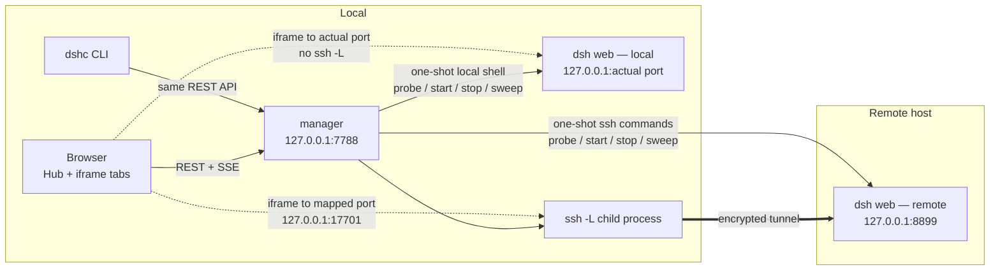

# DSH Center

[中文](README.md) · **English**

[](https://github.com/shendeguize/Remote_DSH_Center/actions/workflows/ci.yml)
[](https://shendeguize.github.io/Remote_DSH_Center/)
[](https://nodejs.org/)
[](package.json)
[](LICENSE)

Collect local and remote `dsh web` instances into one page. A small local service plus a
CLI executes and connects to the local instance directly, while `ssh -L` maps remote
instances onto local loopback ports. The Hub and iframe tabs are the everyday workspace;
start, stop, probe, logs and other administration live on a secondary management page.

**[▶ Live demo](https://shendeguize.github.io/Remote_DSH_Center/demo/)** (runs the real
frontend against a browser-side mock backend — every button works, and you can inject
tunnel drops and crashes yourself)
· [Project page](https://shendeguize.github.io/Remote_DSH_Center/)


## The problem

You have one local machine and N remote training boxes. The local instance needs its own
page; for every remote you still `ssh` in, start `dsh web`, remember its port and open an
`ssh -L` to bring it home. Past a handful of machines, just remembering which port belongs
to which box is annoying — and when a tunnel dies at 3am, nothing tells you.

This tool folds every one of those steps into one place:

- **Two native transports.** `hosts.<name>.local: true` explicitly means local, so the
  protocol script goes straight to the local shell; every other host still uses SSH.
  The browser connects to the actual local web port, with no `ssh -L`.
- **Nothing resident on the remote, nothing to install there.** No agent, no daemon.
  Probing, starting and stopping are single one-shot `ssh` invocations. The only remote
  footprint is `~/.dsh_center_remote/` (logs and optional patch files).
- **Hub plus persistent tabs.** Every enabled, openable host stays in the top bar and on
  the Hub. One click starts and enters a `ready` host. Switching views only toggles iframe
  visibility, so in-page session state survives.
- **Self-healing remote tunnels.** A dropped SSH tunnel reconnects with
  1/2/4/8/16/30s backoff. A local host has no tunnel, never enters `degraded`, and goes
  straight to `crashed` when its process is gone.
- **Never kills the wrong process.** Before stopping either a local or remote process,
  the recorded `ps` command-line fingerprint is compared verbatim; a mismatch refuses the
  kill. Instances someone started by hand are read-only.
- **Zero npm dependencies.** Runtime and tests use only Node ≥ 22 built-ins; the frontend
  is native ESM with no build step.

## Requirements

| | |
|---|---|
| Local | macOS (primary target; `dshc service` autostart is launchd-only) or Linux; **Node ≥ 22**. A local `dsh` installation and web profile are needed only if you choose to manage this machine |
| Remote | DeepSeek Harness (`dsh`) installed with a web profile configured. This tool **probes** only — it does not install anything |
| Connectivity | Hosts come from `~/.ssh/config` with key-based login; the remote must not disable `AllowTcpForwarding` |

Local management is optional: setup offers one built-in local candidate, which you may
leave unselected. A manager may contain at most one `local:true` entry, and an SSH host
is never guessed to be local just because it is named `localhost` or `127.0.0.1`.
Any target missing `dsh` or its web profile is labelled "not installed / not configured"
explicitly rather than pretending to be usable.

## Install

```bash
curl -fsSL https://raw.githubusercontent.com/shendeguize/Remote_DSH_Center/main/install.sh | bash
```

The script only bootstraps, and **works whether or not you have Node** — it picks a channel:

| Channel | When | What lands |
|---|---|---|
| **git** | You have `node ≥ 22` (the usual case) | Clone of the `release` branch into `~/.dsh_center/app`; `dshc` symlinks to `src/cli.js` |
| **standalone** | No node, or too old (**macOS only**, automatic fallback) | The matching-architecture release bundle (**ships its own official Node runtime**), SHA256-verified before it is unpacked; `dshc` symlinks to the launcher inside the bundle |

Both channels hand off to `scripts/install.mjs` for the actual install (symlink rather than
copy, conflict classification, PATH hint). **Re-running it is how you upgrade**; it never
installs twice. Read [install.sh](install.sh) if you want to know exactly what it touches.

The standalone channel **never touches the node on your machine** — it carries its own
copy and uses it only inside the bundle. There are no Linux bundles (on Linux, install
Node ≥ 22 first and re-run).

Choosing a channel and a version:

```bash
curl -fsSL <the URL above> | bash -s -- --standalone         # force the bundle channel
curl -fsSL <the URL above> | bash -s -- --git                # force git (errors out if node is missing)
curl -fsSL <the URL above> | bash -s -- --pre                # allow pre-release versions
curl -fsSL <the URL above> | bash -s -- --version v0.1.0     # pin a Release (bundle channel)
curl -fsSL <the URL above> | DSHC_REF=main bash              # git channel, follow the trunk
curl -fsSL <the URL above> | DSHC_REF=v0.1.0 bash            # git channel, pin a version
```

Passing flags through a pipe needs `bash -s --`:

```bash
curl -fsSL <the URL above> | bash -s -- --service              # also install launchd autostart
curl -fsSL <the URL above> | bash -s -- --prefix /usr/local/bin # different symlink location
```

If you would rather no script touched your machine, this is equivalent:

```bash
git clone -b release https://github.com/shendeguize/Remote_DSH_Center.git ~/.dsh_center/app
cd ~/.dsh_center/app && npm run install:cli
```

To confirm what you ended up with: `dshc version` (version, channel, which Node, where).

Then three commands to get going:

```bash
dshc init      # four steps: manager/mapped ports, agreed web port, local and remote candidates, confirm
dshc up        # start the manager in the background
dshc open      # open the Hub (the root may restore the last openable host)
```

In step 3, `dshc init` lists the built-in local candidate alongside remote candidates from
`~/.ssh/config` and probes them one by one (slow hosts never block your selection). If the
local candidate is unselected, it is not written to config. You can also skip installing
entirely and run `node src/cli.js <command>`.

## A look around

Screenshots are generated by `npm run site:shots` in a headless browser, so they track the
code instead of going stale.

| | |
|---|---|
|  |  |
| **First-run wizard**: four steps and you are done. Step 3 includes local and SSH candidates; only "ready" hosts may autostart | **Manage and host detail**: `#/manage` keeps the host table, global actions and configuration drawer, with direct-connection language for local hosts |
|  |  |
| **Tabs**: the screenshot uses a standalone mock with the real dsh web interaction shape; normal use loads the target's real dsh web, shows loading on first load and keeps the iframe alive across views | **Remote disconnect**: an overlay covers the pane but keeps its content; it clears on reconnect without a reload. Local direct connections never enter this state |

## Architecture and data flow



Three things worth knowing:

- **The manager is the single source of truth.** The frontend never guesses a port: the
  iframe's `src` is the `mappedUrl` the manager hands down, and every runtime parameter
  arrives in a response payload.
- **Control plane and data plane are separate.** Control goes through the manager's
  REST/SSE API, then through a local shell or one-shot SSH running the same protocol
  scripts. The data plane (pages, assets, WebSockets) connects directly from the browser:
  the actual web port for local, an `ssh -L` mapped port for remote, never a manager proxy.
- **Only SSE advances state.** Clicking a button never optimistically mutates a phase —
  the UI waits for the server's `host-changed` and `operation-done` frames, so what you
  see is the real state.

## Everyday entry points

- `#/hub` is the default start page. The `#/` root restores the last host only while it
  remains openable; otherwise it lands on the Hub. Clicking the brand always goes
  explicitly to the Hub and does not invoke `lastHost`.
- Enabled hosts in `ready / starting / running / degraded / crashed` stay in the top bar.
  Clicking a `ready` tab or Hub card performs "start and enter" in one step, with an
  overlay showing progress.
- `#/manage` is the secondary management entry for the host table, probe-all, reload,
  global defaults and events. A host menu can open that host's drawer or its mapped URL
  in a new window.
- A local host has no tunnel to reconnect and never enters `degraded`; the UI hides or
  refuses those meaningless operations.

## States and self-healing

Each host moves through eight phases:

```
unknown → unreachable / no_dsh / ready          (the three probe outcomes)
ready   → starting → running                    (start)
running → degraded → running                    (tunnel dropped and came back)
running → crashed → starting → running          (target process died, manual restart)
```

- Tunnel drop → `degraded`, reconnect backing off 1/2/4/8/16/30s. If the remote explicitly
  forbids forwarding (`AllowTcpForwarding=no`) it suspends instead of looping pointlessly.
- A sweep every 30s first probes the forward locally with a minimal HTTP request and
  **requires bytes back** — ssh keeps `accept`ing after the remote instance dies, so
  checking only `connect` yields false health. If that fails, it re-verifies over ssh:
  genuinely dead becomes `crashed`, still alive just gets a fresh tunnel child process.
- After the manager itself restarts it **does not re-launch managed processes**: it
  re-verifies fingerprints and adopts existing instances, rebuilding remote tunnels or
  re-registering local direct entries.
- Local hosts reuse the same HTTP check and verbatim fingerprint verification but have no
  transport channel to rebuild. A dead process becomes `crashed`; a matching live process
  whose port does not respond stays `running` for the next sweep rather than inventing
  `degraded`.

## Configuration and data

Every runtime parameter comes from `~/.dsh_center/config.json` (`DSHC_HOME` relocates it).
The code holds exactly one factory-default table, `src/defaults.js`:

```
~/.dsh_center/
  config.json    # only config source: manager port, agreed web port, mapped-port range, per-host transport/switches/injection
  state.json     # runtime state (target pid/port/fingerprint, tunnel or direct entry, patch sync records); safe to delete
  manager.log    # event log; long text such as ssh stderr lands here as indented continuations
  manager.pid
  app/           # where the one-click installer puts the code (not here if you cloned manually)
```

Each host config has an optional `local` identity. An older config without it is treated as
`false` (SSH) and does not need setup again. A local entry requires `localPort: null`, and
there may be at most one; its page URL always comes from that run's actual `dsh web` port
instead of consuming the mapped-port pool.

The agreed `dsh web` port is 8899 out of the box; if it is taken, the launcher falls back
to `--port 0` and lets the target OS assign one. A remote also gets a local mapped port
from the configured range, fixed across restarts. A local host uses its actual web port.

Each host may also set a **working directory** (`hosts.<host>.workdir`) — the process
working directory of the target `dsh web`, which is also dsh's default workspace root and
where `AGENTS.md` is loaded from. Empty (`null`) means the target account's home directory.
Only absolute paths or `~`, `~/…` are accepted (`~` is expanded by that account); if the directory
cannot be entered, the start fails loudly instead of silently falling back to home.

```bash
dshc config set hosts.gpu-1.workdir '~/projects/foo'   # empty string or null clears it back to home
```

Like the other injection settings, this follows the **takes effect on next start** rule:
saving never disturbs a running instance (the UI shows a "restart to apply" badge).

## Commands

```
Lifecycle: dshc init / up / down / restart / status / logs / service install|uninstall|status
Itself:    dshc version / update    # version --json; update --pre / --ref <branch|tag> / --restart
Hosts:     dshc ls / probe / start / stop / reconnect / log / open / config
Exit codes: 0 success | 1 operation failed | 2 timeout/communication failure | 3 usage error | 130 wait interrupted by Ctrl-C (the operation keeps going)
```

`dshc --help` prints the full usage. Remote candidates come from `~/.ssh/config`
(`DSHC_SSH_CONFIG` points at a different file), and setup adds one safely named local
candidate. To start the manager at login,
`dshc service install` writes a launchd plist whose KeepAlive brings it back if killed.

## Security boundary

This is designed as a **single-user desktop tool on a trusted network**. Please use it
under that assumption:

- The manager binds `127.0.0.1` only and has **no authentication**. Anything that can run
  code on your machine can drive it, including the managed local instance and remotes
  reached through tunnels. Do not expose it on `0.0.0.0` or forward its port to the internet.
- Binding to loopback does not stop a *browser* from making requests on someone else's behalf,
  so there are two cross-site gates: a request carrying an `Origin` must carry the manager's
  own origin, and `Host` must be a loopback name (the latter is what stops "attacker domain
  resolves to 127.0.0.1", which would otherwise put the page inside their origin). The CLI
  sends no `Origin` and is unaffected.
- Remote data uses plain `ssh -L`, with encryption and authentication entirely from your
  ssh config and keys. Local data connects directly to loopback, with no SSH. This tool
  never handles credentials and stores no passwords.
- The managed side, local or remote, writes only `~/.dsh_center_remote/` under that
  account's HOME (logs and patch files). Local patch sync never cleans up existing files
  it cannot prove ownership of, and its destination is constrained to that directory.
- Injected env vars and extra args go verbatim onto the target command line, where `ps`
  can see them — **do not put secrets there**.
- Local and remote stopping only applies to a process whose fingerprint matches verbatim,
  so the worst case is "failed to stop something it should have", never "stopped somebody
  else's process".

## FAQ

**Does it work on Linux?** Yes — manager and CLI both work. Only `dshc service` (autostart)
is launchd-specific; on Linux write a systemd unit pointing at `dshc up --foreground`.

**What if the local or remote target has no dsh?** The probe labels it
"not installed / not configured" with the reason (missing binary vs. missing web profile).
It never tries to install anything or lets you start a host that cannot run.

**Someone else started a `dsh web` on the same box — will you kill it?** No. Such
instances show up as "🔒 manual", read-only; `stop` and `restart` are refused outright.
A fingerprint mismatch always means no kill.

**Will the remote's `X-Frame-Options` block the iframe?** In practice dsh web sets no such
header, so embedding works. The loading state only means "waiting" and cannot diagnose a
cross-origin failure; if embedding is blocked, use "open in a new window" from the host menu.

**Do I need to restart the manager after changing config?** Host-level changes apply on the
next start. Changing `manager.port` is only persisted — it takes a `dshc restart` to move
the listener (the UI says so explicitly).

**If I close the browser tab, does dsh web stop?** No. Local and remote processes, plus
remote tunnels, belong to the manager rather than the browser. Stop an instance explicitly
with `dshc stop <host>`; `dshc down` only closes the manager and transport resources and
does not stop managed dsh web processes as a side effect.

**How do I upgrade?** `dshc update` — it recognises how you installed:

```bash
dshc update              # update to the latest stable release, on your install's channel
dshc update --pre        # allow pre-release (rc) versions
dshc update --restart    # also restart the manager (by default it only reminds you,
                         # since restarting drops every tunnel for a moment)
```

- **git install**: tracks `origin/release`, **fast-forward only**. A dirty working tree, or a
  target that is not a descendant of your current commit, is refused with the reason spelled
  out — it will never merge over your local changes. Roll back with
  `git -C ~/.dsh_center/app checkout v0.1.0`.
- **bundle install**: fetches from Releases and **only writes to disk after the SHA256
  checks out**; the swap is "unpack to `.new`, then atomic rename", and the previous version
  stays at `~/.dsh_center/app.prev` so you can move it back.

Re-running the one-click installer does the same thing. See [CHANGELOG.md](CHANGELOG.md)
for what changed in each version.

## Full uninstall

```bash
dshc service uninstall                              # 1. if you installed launchd autostart
dshc down                                           # 2. stop the manager and its tunnels
node ~/.dsh_center/app/scripts/install.mjs --uninstall   # 3. remove the dshc symlink from PATH
rm -rf ~/.dsh_center                                # 4. delete config, state, logs and code
```

Step 4 removes the manager itself. If you managed the local machine, its logs and patches
remain in `~/.dsh_center_remote/`; after confirming the instance is stopped, remove that
directory separately. Remote hosts use the same per-host cleanup:

```bash
rm -rf ~/.dsh_center_remote
ssh <host> 'rm -rf ~/.dsh_center_remote'
```

If a local or remote `dsh web` is still running, stop it from the management page or with
`dshc stop <host>` first. For a remote process left over,
`ssh <host> 'pkill -f "dsh web"'` cleans up — but note that command does no fingerprint
check and will also kill other people's instances, so use it with care.

## Development

```bash
npm run check         # one gate: tests+coverage → real browser → site & docs → package contents → CLI entry
npm run check -- --only tests      # pick stages; --skip ui / --require-browser / --list
```

Individual layers:

```bash
npm test              # unit + fake-remote integration + CLI e2e + frontend logic/mount + tooling + install.sh
npm run coverage      # coverage report
npm run coverage:gate # src/** overall lines ≥95% + tier floors (lib ≥90%, modules ≥75%, web logic ≥80%)
npm run ui:smoke      # real browser (headless Chrome + CDP): layout, focus, reduced motion, real iframe
```

The gate also fails if any `src/**/*.js` file has no lcov record. Branch and function
coverage are diagnostic only and do not participate in the thresholds.

Site and live demo:

```bash
npm run site:dev      # build _site/ and serve it locally (http://127.0.0.1:4321)
npm run site:build    # build only; _site/ is not committed — Actions deploys it
npm run site:shots    # regenerate the interface screenshots used by the README and landing page
npm run site:check    # site build + headless demo smoke + bilingual README link/command audit
```

How the demo works: `site/demo/demo-shim.js` overrides `window.fetch` and
`window.EventSource`, routing requests to a fake manager living in the browser
([site/demo/demo-manager.js](site/demo/demo-manager.js), whose state transitions reuse the
production `src/lib/machine.js`). Not one byte of `src/web/**` is modified — the demo runs
the real frontend, which is why it cannot drift from the product: if it drifted, the demo
would break first and `npm run check` would go red.

Tests never touch real machines: `tests/harness/` supplies fake ssh/scp, local-shell and
dsh-web shims plus a state engine, 15 remote fault scenarios and a local end-to-end flow.
Every protocol branch is reproducible under an isolated HOME. Real-machine acceptance is
a separate script:

```bash
npm run acceptance:real -- --host <ssh-host>                        # IT-01…13
npm run acceptance:real -- --host <ssh-host> --only IT-06,IT-09 --keep
```

CI ([.github/workflows/ci.yml](.github/workflows/ci.yml)) runs `npm run check` once on
macOS and once on Ubuntu. The Ubuntu image ships Chrome, so the browser stage is mandatory
there; on the macOS runner it is skipped when no browser is present. Use
`DSHC_CHROME=<path>` to point at a specific binary.

Branching, PRs, releases, fixes and review are all spelled out in
[CONTRIBUTING.md](CONTRIBUTING.md): `main` is the development trunk (squash-merged PRs
only), `release` is the stable pointer (fast-forwarded from main at release time), and
every user-visible change is recorded in [CHANGELOG.md](CHANGELOG.md). The hard
constraints to know before touching code are in [AGENTS.md](AGENTS.md).

Code map: `src/lib/` (escaping, protocol templates, ssh executor, state machine, validators
— mostly pure functions), `src/` (store/ports/prober/launcher/tunnel/monitor/api/server/
cli/daemon), `src/web/` (native ESM frontend, logic split from DOM components for
testability), `site/` (landing page and live demo). Which test guards which code path is
listed in [tests/COVERAGE_MATRIX.md](tests/COVERAGE_MATRIX.md).

## License

[MIT](LICENSE)
