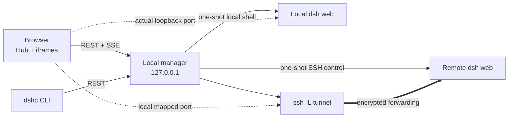

# DSH Center

[中文](README.md) · **English**

[](https://github.com/shendeguize/Remote_DSH_Center/actions/workflows/ci.yml)
[](https://shendeguize.github.io/Remote_DSH_Center/)
[](https://nodejs.org/)
[](package.json)
[](LICENSE)

Open local and remote `dsh web` instances from one Hub on your machine. Local instances connect
directly; remote instances are mapped onto local loopback through `ssh -L`. Nothing is installed
or kept resident on remote hosts: probe, start, and stop are all one-shot SSH commands.

**[▶ Live demo](https://shendeguize.github.io/Remote_DSH_Center/demo/)** — the real frontend
against an in-browser mock manager; try start, disconnect, and recovery ·
[Project page](https://shendeguize.github.io/Remote_DSH_Center/)


*Hub — every available host, current state, and entry point on one page.*

**Five-minute quick start**

```bash
curl -fsSL https://raw.githubusercontent.com/shendeguize/Remote_DSH_Center/main/install.sh | bash
dshc init      # four steps: ports → remote convention → choose local/SSH hosts → confirm
dshc up        # start the local manager in the background
dshc open      # open the Hub in your browser
```

The installer chooses the git or macOS standalone channel automatically; the wizard probes a
local candidate plus remotes from `~/.ssh/config`. See the [handbook](HANDBOOK.en.md) for every
install option and first-start detail.

## The problem

- **One local + remote entry point.** The browser uses the actual local web port or an
  `ssh -L` mapped port for a remote.
- **Nothing resident or installed remotely.** Control actions use one-shot SSH; remote
  artifacts stay under `~/.dsh_center_remote/`.
- **Hub plus persistent tabs.** Start and enter a `ready` host in one click; iframe sessions
  survive view switches without reloads.
- **Self-healing tunnels.** A remote disconnect becomes `degraded` and retries with backoff;
  only a genuinely dead process becomes `crashed`.
- **Never kills the wrong process.** Stop compares the `ps` command-line fingerprint verbatim;
  manual instances are read-only, and a mismatch refuses the kill.
- **Zero npm dependencies.** Runtime and tests use Node ≥ 22 built-ins; the frontend is native
  ESM with no build step.

## Requirements

- Source / git installs need **Node ≥ 22**; macOS standalone bundles carry official Node.
- Every managed local or remote target needs DeepSeek Harness (`dsh`) and a configured web
  profile. Center probes for them; it does not install `dsh`.
- Put remote hosts in `~/.ssh/config`, enable key-based login, and allow TCP forwarding.
  Managing the local machine is optional.

## Support matrix

| Platform | Install and release commitment | Verification |
|---|---|---|
| macOS arm64 (Apple Silicon) | First-class source / git install and standalone Release bundle | Matching bundle built and verified on real hardware |
| macOS x64 (Intel) | First-class source / git install and standalone Release bundle | Matching bundle built and verified on real hardware |
| Linux | Best-effort source / git installation and foreground operation; no bundle or `dshc service` | Project gates run in Ubuntu CI |

**Node 22** is the tested minimum for source / git installs. Any increase is announced in the
[CHANGELOG](CHANGELOG.md) and corresponding release notes.

## Install

The one-command installer is at the top of this page. See the
[installation handbook](HANDBOOK.en.md#installation) for forced channels, pre-releases,
install prefixes, launchd autostart, manual installation, and bundle provenance verification
with `SHA256SUMS` plus `gh attestation verify`.

## A look around

All screenshots below come from the same headless-browser capture flow and reuse only product
shots under `site/assets/shots/`.

| | |
|---|---|
|  |  |
| *First-run wizard — probe candidates and choose managed hosts.* | *Host details — configuration, logs, and actions in one place.* |
|  |  |
| *Workspace tab — iframe switches do not reload.* | *Disconnect recovery — content stays while the tunnel reconnects.* |

## Architecture and data flow



- The manager is the single source of truth for runtime state and ports; the frontend only uses
  the `mappedUrl` returned by the backend.
- The control plane is REST/SSE followed by local shell or one-shot SSH. Pages, assets, and
  WebSockets connect directly from the browser to the actual local port or remote mapped port;
  the manager does not proxy the data plane.
- The UI never advances state optimistically; it waits for SSE events. See
  [architecture details](HANDBOOK.en.md#architecture-details) for the state machine and recovery.

## Everyday entry points

- `#/hub` is the default entry; a `ready` host starts and opens in one step, and iframe view
  switches do not reload it.
- `#/manage` provides probe-all, configuration reload, global defaults, events, and host details.

## States and self-healing

A remote disconnect becomes `degraded` and retries with 1/2/4/8/16/30-second backoff. A
30-second sweep requires actual HTTP response bytes before deep SSH verification. A manager
restart adopts fingerprint-matched survivors instead of relaunching them. See the
[handbook](HANDBOOK.en.md#states-and-self-healing) for the full state machine.

## Configuration and data

The only runtime configuration is `~/.dsh_center/config.json` (`DSHC_HOME` relocates it). See
[the handbook](HANDBOOK.en.md#configuration-and-data) for launch directories, dsh Workspace
registration, concurrency-safe editing of `${DSH_HOME:-$HOME/.dsh}/settings.yaml`, and artifact
boundaries.

## Commands

```text
Lifecycle: dshc init / up / down / restart / status / logs / service install|uninstall|status
Itself:    dshc version / update
Hosts:     dshc ls / probe / start / stop / reconnect / log / open / config
Exit codes: 0 success | 1 operation failed | 2 timeout/communication failure | 3 usage error | 130 Ctrl-C interrupted the wait (operation continues)
```

## Security boundary

> The manager listens on `127.0.0.1` and has **no authentication**. Never expose it on
> `0.0.0.0` or forward it to the public internet.

Stop verifies the process fingerprint verbatim. Injected environment variables and arguments
appear in `ps`, so never put secrets there. See the
[handbook](HANDBOOK.en.md#security-boundary) for cross-site defenses, configuration credential
handling, and artifact path restrictions.

## FAQ

**Does it work on Linux?** Source / git installation and foreground operation are best-effort,
with project gates running in Ubuntu CI. There is no Linux bundle, and `dshc service` is
unavailable because it requires macOS launchd.

**Does closing the browser stop an instance?** No. `dshc down` also stops only the manager and
transport resources; use `dshc stop <host>` to stop a managed instance. See the
[handbook FAQ](HANDBOOK.en.md#faq) for more.

## Full uninstall

Follow the [handbook procedure](HANDBOOK.en.md#full-uninstallation) to stop instances, remove
the service and CLI, and then delete manager data. Do not replace `dshc stop` with the
unfingerprinted `pkill -f "dsh web"`; it may kill other users' matching processes.

### Documentation

- [English handbook](HANDBOOK.en.md) · [中文使用手册](HANDBOOK.md)
- [Changelog](CHANGELOG.md)
- [Contributing and PR rules](CONTRIBUTING.md)
- [Hard constraints before code changes](AGENTS.md)

## Development

This repository has zero dependencies, so there is no `npm install` step:

```bash
npm run check         # complete quality gate
npm run site:check    # site, demo, bilingual README links and commands
```

See [development and real-machine acceptance](HANDBOOK.en.md#development-and-real-machine-acceptance)
for test layers, site development, the code map, and acceptance commands. Branching, commits,
PRs, releases, and review follow [CONTRIBUTING.md](CONTRIBUTING.md).

## License

[MIT](LICENSE)
