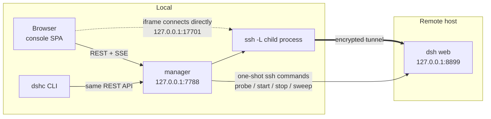

# DSH Center

[中文](README.md) · **English**

[](https://github.com/shendeguize/Remote_DSH_Center/actions/workflows/ci.yml)
[](https://shendeguize.github.io/Remote_DSH_Center/)
[](https://nodejs.org/)
[](package.json)
[](LICENSE)

Collect the `dsh web` instances scattered across your remote machines into one local page.
A small local service plus a CLI: `ssh -L` tunnels map each remote `dsh web` onto a local
loopback port, and a single-entry console opens them as iframe tabs — start, stop,
reconnect and read logs all in one place.

**[▶ Live demo](https://shendeguize.github.io/Remote_DSH_Center/demo/)** (runs the real
frontend against a browser-side mock backend — every button works, and you can inject
tunnel drops and crashes yourself)
· [Project page](https://shendeguize.github.io/Remote_DSH_Center/)


## The problem

You have N remote training boxes. For each one you `ssh` in, start a `dsh web`, remember
which port it listens on, open an `ssh -L` to bring that port home, and bookmark yet
another `127.0.0.1:178xx`. Past a handful of machines, just remembering which port belongs
to which box is annoying — and when a tunnel dies at 3am, nothing tells you.

This tool folds every one of those steps into one place:

- **Nothing resident on the remote, nothing to install there.** No agent, no daemon.
  Probing, starting and stopping are single one-shot `ssh` invocations. The only remote
  footprint is `~/.dsh_center_remote/` (logs and optional patch files).
- **Single-entry tabs.** Every running host gets a tab whose content is the real remote
  dsh web. Switching tabs only toggles visibility — the iframe is never reloaded, so
  in-page session state survives.
- **Self-healing tunnels.** If a tunnel drops, reconnect backs off 1/2/4/8/16/30s and
  returns to `running` on success. Only when a 30s sweep proves the remote process is
  actually gone does the host go `crashed`.
- **Never kills the wrong process.** Before stopping a remote process, the recorded `ps`
  command-line fingerprint is compared verbatim; a mismatch refuses the kill. Instances
  someone started by hand are read-only.
- **Zero npm dependencies.** Runtime and tests use only Node ≥ 22 built-ins; the frontend
  is native ESM with no build step.

## Requirements

| | |
|---|---|
| Local | macOS (primary target; `dshc service` autostart is launchd-only) or Linux; **Node ≥ 22** |
| Remote | DeepSeek Harness (`dsh`) installed with a web profile configured. This tool **probes** only — it does not install anything |
| Connectivity | Hosts come from `~/.ssh/config` with key-based login; the remote must not disable `AllowTcpForwarding` |

Hosts missing `dsh` or the web profile are labelled "not installed / not configured"
explicitly, rather than pretending to be usable.

## Install

```bash
curl -fsSL https://raw.githubusercontent.com/shendeguize/Remote_DSH_Center/main/install.sh | bash
```

The script only bootstraps: check `git` and `node ≥ 22` → clone into `~/.dsh_center/app`
(or `git pull` if it is already there) → hand off to the repo's `scripts/install.mjs`,
which symlinks `dshc` into `~/.local/bin`. **Re-running it is how you upgrade**; it never
installs twice. It is about a hundred lines — read [install.sh](install.sh) if you want to
know exactly what it touches.

Passing flags through a pipe needs `bash -s --`:

```bash
curl -fsSL <the URL above> | bash -s -- --service              # also install launchd autostart
curl -fsSL <the URL above> | bash -s -- --prefix /usr/local/bin # different symlink location
```

If you would rather no script touched your machine, this is equivalent:

```bash
git clone https://github.com/shendeguize/Remote_DSH_Center.git ~/.dsh_center/app
cd ~/.dsh_center/app && npm run install:cli
```

Then three commands to get going:

```bash
dshc init      # four-step wizard: local port, agreed remote port, which hosts to manage
dshc up        # start the manager in the background
dshc open      # open the console in your browser
```

`dshc init` reads `~/.ssh/config`, lists candidate hosts and probes them one by one (slow
hosts never block your selection). You can also skip installing entirely and run
`node src/cli.js <command>`.

## A look around

Screenshots are generated by `npm run site:shots` in a headless browser, so they track the
code instead of going stale.

| | |
|---|---|
|  |  |
| **First-run wizard**: four steps and you are done. Step 3 probes each host; only "ready" hosts may be enabled | **Host detail**: working directory, env vars, extra args, patch files, plus remote logs and probe details |
|  |  |
| **Tabs**: the iframe holds the real remote dsh web — static assets and WebSockets all ride the tunnel | **Disconnected**: an overlay covers the pane but the page content stays; it clears on reconnect without a reload |

## Architecture and data flow



Three things worth knowing:

- **The manager is the single source of truth.** The frontend never guesses a port: the
  iframe's `src` is the `mappedUrl` the manager hands down, and every runtime parameter
  arrives in a response payload.
- **Control plane and data plane are separate.** Control goes through the manager's
  REST/SSE API; the data plane (dsh web pages, assets, WebSockets) is a direct browser
  connection to the local mapped port and is never proxied through the manager.
- **Only SSE advances state.** Clicking a button never optimistically mutates a phase —
  the UI waits for the server's `host-changed` and `operation-done` frames, so what you
  see is the real state.

## States and self-healing

Each host moves through eight phases:

```
unknown → unreachable / no_dsh / ready          (the three probe outcomes)
ready   → starting → running                    (start)
running → degraded → running                    (tunnel dropped and came back)
running → crashed → starting → running          (remote process died, manual restart)
```

- Tunnel drop → `degraded`, reconnect backing off 1/2/4/8/16/30s. If the remote explicitly
  forbids forwarding (`AllowTcpForwarding=no`) it suspends instead of looping pointlessly.
- A sweep every 30s first probes the forward locally with a minimal HTTP request and
  **requires bytes back** — ssh keeps `accept`ing after the remote instance dies, so
  checking only `connect` yields false health. If that fails, it re-verifies over ssh:
  genuinely dead becomes `crashed`, still alive just gets a fresh tunnel child process.
- After the manager itself restarts it **does not re-launch remotes**: it re-verifies
  fingerprints, adopts the existing processes and rebuilds only the tunnels.

## Configuration and data

Every runtime parameter comes from `~/.dsh_center/config.json` (`DSHC_HOME` relocates it).
The code holds exactly one factory-default table, `src/defaults.js`:

```
~/.dsh_center/
  config.json    # the only config source: manager port, default remote port, local port range, per-host switches and injection
  state.json     # runtime state (remote pid/port/fingerprint, tunnels, patch sync records); safe to delete
  manager.log    # event log; long text such as ssh stderr lands here as indented continuations
  manager.pid
  app/           # where the one-click installer puts the code (not here if you cloned manually)
```

The remote `dsh web` port is an agreed default (8899 out of the box); if it is taken, the
launcher falls back to `--port 0` and lets the remote OS assign one. Local mapped ports are
allocated from the configured range and, once given to a host, stay put across restarts.

Each host may also set a **working directory** (`hosts.<host>.workdir`) — the process
working directory of the remote `dsh web`, which is also dsh's default workspace root and
where `AGENTS.md` is loaded from. Empty (`null`) means the remote home directory. Only
absolute paths or `~`, `~/…` are accepted (`~` is expanded remotely); if the directory
cannot be entered, the start fails loudly instead of silently falling back to home.

```bash
dshc config set hosts.gpu-1.workdir '~/projects/foo'   # empty string or null clears it back to home
```

Like the other injection settings, this follows the **takes effect on next start** rule:
saving never disturbs a running instance (the UI shows a "restart to apply" badge).

## Commands

```
Lifecycle: dshc init / up / down / restart / status / logs / service install|uninstall|status
Hosts:     dshc ls / probe / start / stop / reconnect / log / open / config
Exit codes: 0 success | 1 operation failed | 2 timeout/communication failure | 3 usage error
```

`dshc --help` prints the full usage. The host list comes from `~/.ssh/config`
(`DSHC_SSH_CONFIG` points at a different file). To start the manager at login,
`dshc service install` writes a launchd plist whose KeepAlive brings it back if killed.

## Security boundary

This is designed as a **single-user desktop tool on a trusted network**. Please use it
under that assumption:

- The manager binds `127.0.0.1` only and has **no authentication**. Anything that can run
  code on your machine can drive it, and therefore reach your remotes through the tunnels.
  Do not expose it on `0.0.0.0` and do not forward its port to the internet.
- The tunnel is plain `ssh -L`: encryption and authentication are entirely your ssh config
  and keys. This tool never handles credentials and stores no passwords.
- On the remote it only writes `~/.dsh_center_remote/` (logs and patch files). It touches
  no system directories and installs nothing resident.
- Injected env vars and extra args go verbatim onto the remote command line, where `ps` can
  see them — **do not put secrets there**.
- Stopping only applies to processes whose fingerprint matches verbatim, so the worst case
  is "failed to stop something it should have", never "stopped somebody else's process".

## FAQ

**Does it work on Linux?** Yes — manager and CLI both work. Only `dshc service` (autostart)
is launchd-specific; on Linux write a systemd unit pointing at `dshc up --foreground`.

**What if the remote has no dsh?** The probe labels it "not installed / not configured"
with the reason (missing binary vs. missing web profile). It never tries to install
anything and never lets you start a host that cannot run.

**Someone else started a `dsh web` on the same box — will you kill it?** No. Such
instances show up as "🔒 manual", read-only; `stop` and `restart` are refused outright.
A fingerprint mismatch always means no kill.

**Will the remote's `X-Frame-Options` block the iframe?** In practice dsh web sets no such
header, so embedding works. If one ever does block, the tab shows an explicit failure with
an "open in a new window" escape hatch.

**Do I need to restart the manager after changing config?** Host-level changes apply on the
next start. Changing `manager.port` is only persisted — it takes a `dshc restart` to move
the listener (the UI says so explicitly).

**If I close the browser tab, does the remote process stop?** No. Remote processes and
tunnels belong to the manager, not the browser. Stop one explicitly, or stop the manager
(`dshc down` closes the tunnels it opened first).

**How do I upgrade?** Re-run the one-click installer, or just
`git -C ~/.dsh_center/app pull` — the install is a symlink, so updated code takes effect
immediately.

## Full uninstall

```bash
dshc service uninstall                              # 1. if you installed launchd autostart
dshc down                                           # 2. stop the manager and its tunnels
node ~/.dsh_center/app/scripts/install.mjs --uninstall   # 3. remove the dshc symlink from PATH
rm -rf ~/.dsh_center                                # 4. delete config, state, logs and code
```

After step 4 nothing is left locally. On the remote side, delete `~/.dsh_center_remote/`
(logs and patch files only):

```bash
ssh <host> 'rm -rf ~/.dsh_center_remote'
```

If a remote `dsh web` is still running, stop it from the console or with
`dshc stop <host>` first. For anything left over, `ssh <host> 'pkill -f "dsh web"'` cleans
up — but note that command does no fingerprint check and will also kill other people's
instances, so use it with care.

## Development

```bash
npm run check         # one gate: tests+coverage → real browser → site & docs → package contents → CLI entry
npm run check -- --only tests      # pick stages; --skip ui / --require-browser / --list
```

Individual layers:

```bash
npm test              # unit + fake-remote integration + CLI e2e + frontend logic/mount + tooling + install.sh
npm run coverage      # coverage report
npm run coverage:gate # three-tier thresholds (lib ≥90%, module layer ≥75%, web logic ≥80%)
npm run ui:smoke      # real browser (headless Chrome + CDP): layout, focus, reduced motion, real iframe
```

Site and live demo:

```bash
npm run site:dev      # build _site/ and serve it locally (http://127.0.0.1:4321)
npm run site:build    # build only; _site/ is not committed — Actions deploys it
npm run site:shots    # regenerate the interface screenshots used by the README and landing page
npm run site:check    # site build + headless demo smoke + bilingual README link/command audit
```

How the demo works: `site/demo/demo-shim.js` overrides `window.fetch` and
`window.EventSource`, routing requests to a fake manager living in the browser
([site/demo/demo-manager.js](site/demo/demo-manager.js), whose state transitions reuse the
production `src/lib/machine.js`). Not one byte of `src/web/**` is modified — the demo runs
the real frontend, which is why it cannot drift from the product: if it drifted, the demo
would break first and `npm run check` would go red.

Tests never touch real machines: `tests/harness/` is a set of fake ssh/scp/dsh-web shims
plus a state engine and 15 fault scenarios, so every branch of the protocol templates is
reproducible locally. Real-machine acceptance is a separate script:

```bash
npm run acceptance:real -- --host <ssh-host>                        # IT-01…13
npm run acceptance:real -- --host <ssh-host> --only IT-06,IT-09 --keep
```

CI ([.github/workflows/ci.yml](.github/workflows/ci.yml)) runs `npm run check` once on
macOS and once on Ubuntu. The Ubuntu image ships Chrome, so the browser stage is mandatory
there; on the macOS runner it is skipped when no browser is present. Use
`DSHC_CHROME=<path>` to point at a specific binary.

Code map: `src/lib/` (escaping, protocol templates, ssh executor, state machine, validators
— mostly pure functions), `src/` (store/ports/prober/launcher/tunnel/monitor/api/server/
cli/daemon), `src/web/` (native ESM frontend, logic split from DOM components for
testability), `site/` (landing page and live demo). Which test guards which code path is
listed in [tests/COVERAGE_MATRIX.md](tests/COVERAGE_MATRIX.md).

## License

[MIT](LICENSE)
