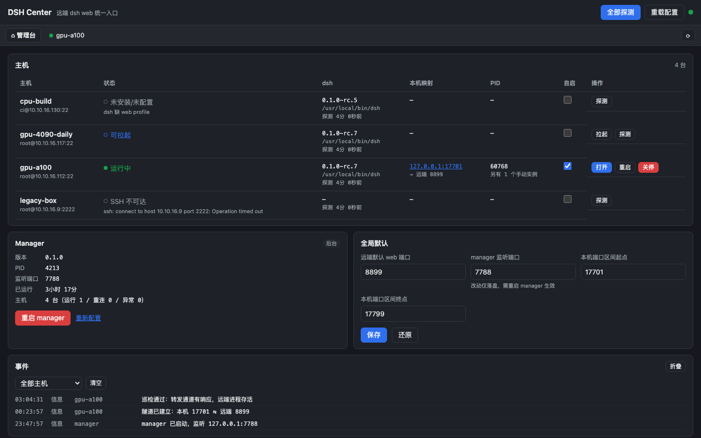
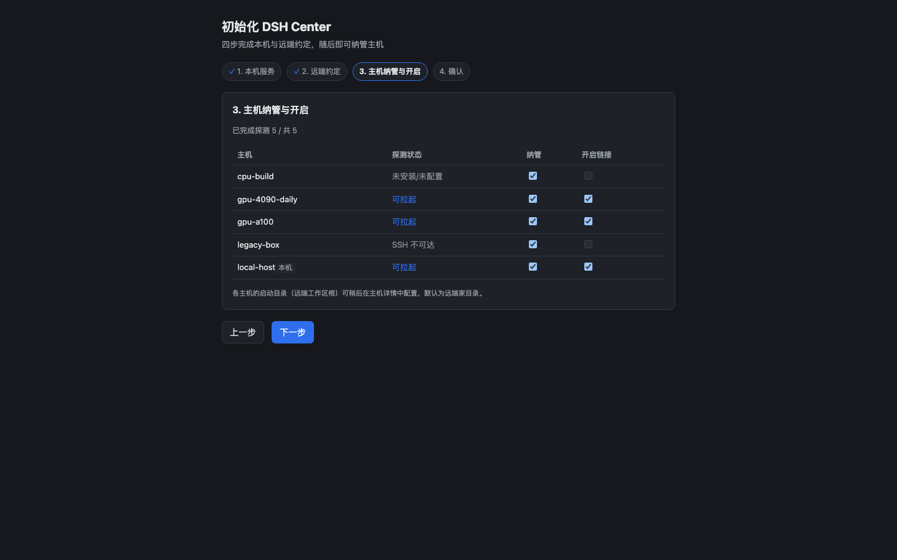
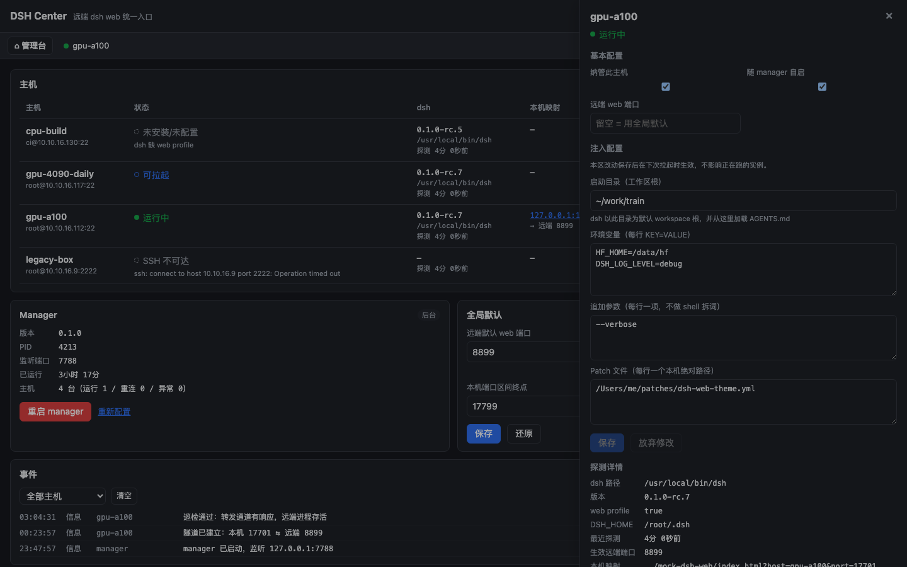
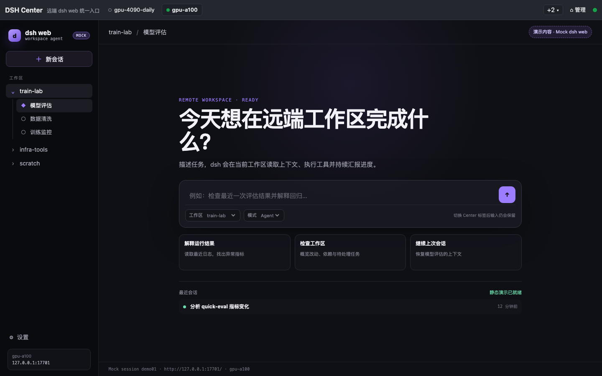
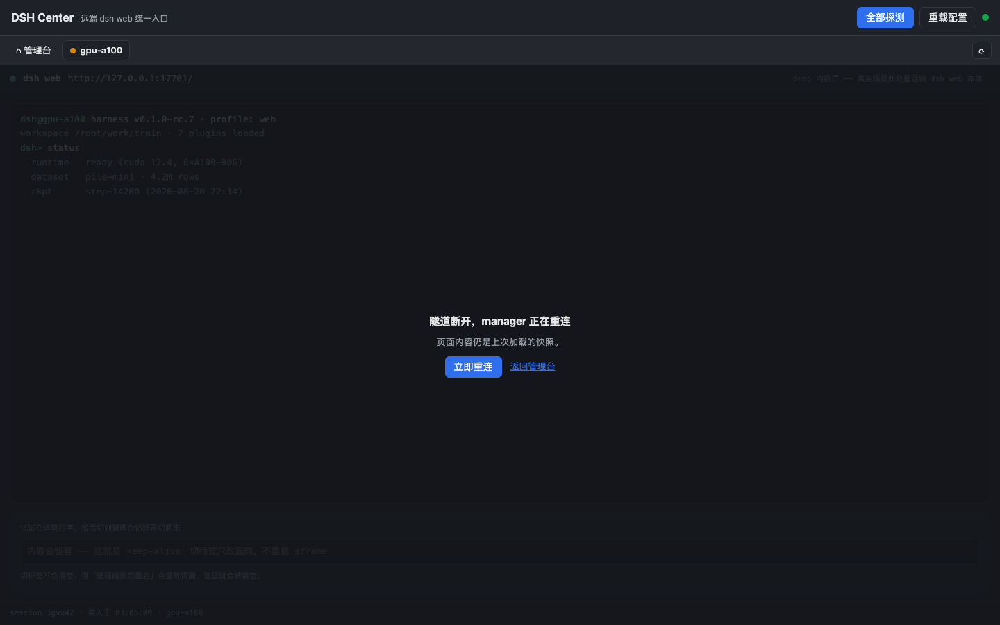
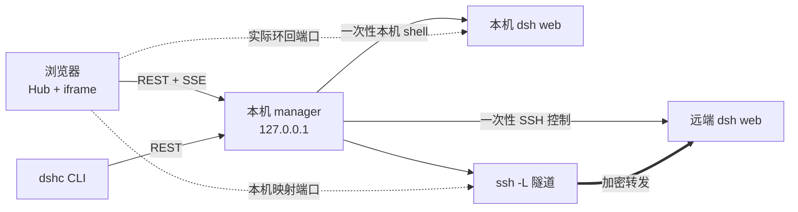

# DSH Center

**中文** · [English](README.en.md)

[](https://github.com/shendeguize/Remote_DSH_Center/actions/workflows/ci.yml)
[](https://shendeguize.github.io/Remote_DSH_Center/)
[](https://nodejs.org/)
[](package.json)
[](LICENSE)

在本机用一个 Hub 打开本机与多台远端主机上的 `dsh web`：本机实例直接连接，远端实例经
`ssh -L` 安全映射到本机环回地址。远端无需安装 agent、无需常驻守护进程，探测、拉起与关停
都由一次性 SSH 命令完成。

**[▶ Live demo](https://shendeguize.github.io/Remote_DSH_Center/demo/)** — 真实前端 +
浏览器内模拟 manager，可直接体验拉起、断联与恢复 ·
[项目主页](https://shendeguize.github.io/Remote_DSH_Center/)



*Hub — 所有可用主机、运行状态与入口集中在一页。*

## 5 分钟上手

最小前提：manager 运行在 macOS 或 Linux；源码 / git 通道需要 Node ≥ 22；受管目标已配置
`dsh` web profile，远端还需免密 SSH 与 TCP 转发。细节见[前提](#前提)。

```bash
curl -fsSL https://raw.githubusercontent.com/shendeguize/Remote_DSH_Center/main/install.sh | bash
export PATH="$HOME/.local/bin:$PATH"  # 默认 prefix；自定义 prefix 请按安装器提示加入 PATH
dshc init      # 四步向导：端口 → 远端约定 → 选择本机/SSH 主机 → 确认
dshc up        # 后台启动本机 manager
dshc open      # 在浏览器打开 Hub
```

默认安装把 `dshc` 链接到 `~/.local/bin`，上面的 `export` 让当前 shell 立即可用；若指定了
`--prefix`，请改为安装器提示的目录。安装器会自动选择 git 或 macOS standalone 通道；向导会探测本机候选和
`~/.ssh/config` 中的远端候选。完整安装选项与首次启动说明见[使用手册](HANDBOOK.md)。

## 它解决什么问题

- **本机 + 远端统一入口**：本机浏览器直连实际 web 端口；远端页面走 `ssh -L` 映射端口。
- **本机多 profile**：管理页可添加多个具名本机实例；为每个实例设置不同 web 端口，并在
  “追加参数”中逐行填写 `--profile` 与 profile 名称（例如 `dcs`）。各实例独立维护 PID、状态与页面。
- **远端零常驻、零安装**：控制动作使用单条一次性 SSH；Center 管理的日志、patch 与临时文件在
  `~/.dsh_center_remote/`。唯一显式例外是用户保存 dsh 配置时写入
  `${DSH_HOME:-$HOME/.dsh}/settings.yaml`。
- **Hub + 保活标签页**：`ready` 主机一步拉起并进入；切页不重载 iframe，会话状态保留。
- **隧道自愈**：远端断联进入 `degraded` 并退避重连；进程真死才标为 `crashed`。
- **不误杀**：关停前逐字核对 `ps` 命令行指纹；手动实例只读，指纹不符就拒杀。
- **零 npm 依赖**：运行时与测试仅使用 Node ≥ 22 内置能力，前端是无需构建的原生 ESM。

## 前提

- 源码 / git / npm 安装需要 **Node ≥ 22**；macOS standalone 发布包自带官方 Node。
- 要纳管的本机或远端已安装 DeepSeek Harness（`dsh`）并配置 web profile；Center 只探测，
  不代装 `dsh`。
- 远端主机已写入 `~/.ssh/config`、可免密登录，且允许 TCP 转发。本机纳管可选。

## 支持矩阵

| 平台 | 安装与发布承诺 | 验证 |
|---|---|---|
| macOS arm64（Apple Silicon） | 一等支持：源码 / git 安装与 standalone Release 包 | 对应架构发布包会构建并实机验包 |
| macOS x64（Intel） | 一等支持：源码 / git 安装与 standalone Release 包 | 对应架构发布包会构建并实机验包 |
| Linux | 源码 / git 安装与前台运行按 best-effort 支持；无发布包和 `dshc service` | Ubuntu CI 跑通项目闸门 |

源码 / git 安装以 **Node 22** 为经过测试的最低版本；若提高，会在
[CHANGELOG](CHANGELOG.md) 与对应 Release notes 中提前说明。

## 安装

一键安装命令见页首。有 Node ≥ 22 的机器也可以 `npm i -g @shendeguize/remote-dsh-center`。强制通道、
预发布版本、安装目录、launchd 自启、手动安装，以及 `SHA256SUMS` +
`gh attestation verify` 发布包溯源验证见[安装手册](HANDBOOK.md#安装)。

## 界面速览

Center 界面截图来自同一套无头浏览器生成流程。iframe 图使用独立的 mock dsh web，仅用于呈现
Center 的嵌入集成轮廓，不是目标产品真实页面截图。

| | |
|---|---|
|  |  |
| *首启向导 — 探测候选并选择纳管主机。* | *主机详情 — 配置、日志与管理动作集中呈现。* |
|  |  |
| *工作标签 — 独立 mock 展示嵌入轮廓；切换不重载。* | *断联恢复 — 内容保留，隧道重连后继续。* |

## 架构与数据流



- manager 是运行状态与端口的单一真相源；前端只使用后端下发的 `mappedUrl`。
- 控制面走 REST/SSE，再落到本机 shell 或一次性 SSH；页面、资源与 WebSocket 由浏览器直连
  本机实际端口或远端映射端口，不经过 manager 代理。
- UI 不乐观修改状态，只根据 SSE 事件推进。架构、状态机与恢复细节见
  [手册的架构章节](HANDBOOK.md#架构细节)。

## 日常入口

- `#/hub` 是默认入口；`ready` 主机可一步拉起并进入，iframe 切页不重载。
- `#/manage` 提供全量探测、配置重载、全局默认、事件和主机详情。

## 状态与自愈

远端断联进入 `degraded`，按 1/2/4/8/16/30 秒退避重连；30 秒巡检要求 HTTP 真正返回字节，
失败后再经 SSH 深复核。manager 重启只接管指纹匹配的存活实例，不会重新拉起进程。完整状态机
见[手册](HANDBOOK.md#状态与自愈)。

## 配置与数据

唯一运行配置是 `~/.dsh_center/config.json`（`DSHC_HOME` 可更换目录）。主机启动目录、
dsh Workspace 登记、`${DSH_HOME:-$HOME/.dsh}/settings.yaml` 的并发安全编辑与落地物边界见
[手册](HANDBOOK.md#配置与数据)。

## 命令一览

```text
生命周期：dshc init / up / down / restart / status / logs / service install|uninstall|status
自身管理：dshc version / update
主机操作：dshc ls / probe / start / stop / reconnect / log / open / config
退出码：0 成功｜1 操作失败｜2 超时/通信失败｜3 用法错误｜130 Ctrl-C 中断等待（操作仍继续）
```

## 安全边界

> manager 只监听 `127.0.0.1` 且**没有鉴权**。不要暴露到 `0.0.0.0` 或转发到公网。

停止前会逐字核对进程指纹；注入的环境变量与参数会出现在 `ps`，不要放密钥。完整跨站防护、
配置文件凭据处理与落地路径限制见[手册](HANDBOOK.md#安全边界)。

## FAQ

**Linux 能用吗？** 源码 / git 安装与前台运行按 best-effort 支持，Ubuntu CI 跑项目闸门；
不提供 Linux 发布包，依赖 macOS launchd 的 `dshc service` 也不可用。

**关闭浏览器会停止实例吗？** 不会。`dshc down` 也只停止 manager 与运输资源；请用
`dshc stop <主机>` 显式停止受管实例。更多问题见[手册 FAQ](HANDBOOK.md#faq)。

## 彻底卸载

按[手册的卸载顺序](HANDBOOK.md#彻底卸载)先停实例、卸载服务与 CLI，再删除 manager 数据。
不要用未经指纹校验的 `pkill -f "dsh web"` 代替 `dshc stop`，它可能误杀其他人的实例。

## 文档

- [中文使用手册](HANDBOOK.md) · [English handbook](HANDBOOK.en.md)
- [版本变化](CHANGELOG.md)
- [参与开发与 PR 规则](CONTRIBUTING.md)
- [改代码前的硬约束](AGENTS.md)

## 开发

零依赖仓库，无需 `npm install`：

```bash
npm run check         # 完整质量闸门
npm run site:check    # 站点、demo、双语 README 链接与命令检查
```

测试分层、站点开发、代码地图与真机验收命令见[手册的开发章节](HANDBOOK.md#开发与真机验收)。
分支、提交、PR、发布与 review 以 [CONTRIBUTING.md](CONTRIBUTING.md) 为准。

## License

[MIT](LICENSE)
