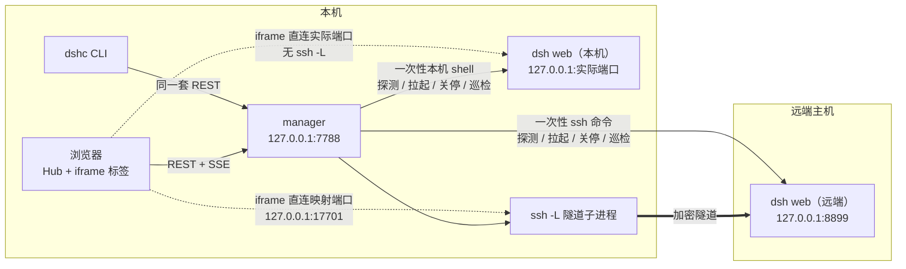

# DSH Center

**中文** · [English](README.en.md)

[](https://github.com/shendeguize/Remote_DSH_Center/actions/workflows/ci.yml)
[](https://shendeguize.github.io/Remote_DSH_Center/)
[](https://nodejs.org/)
[](package.json)
[](LICENSE)

把本机与若干远端主机上的 `dsh web` 收进同一个页面。本机跑一个小服务 + 一个 CLI：
本机实例直接执行、直接访问，远端实例经 `ssh -L` 映射到本机环回地址；Hub 与 iframe 标签页
负责日常工作，拉起、关停、探测、看日志等管理动作集中在次级管理页。

**[▶ 在线 demo](https://shendeguize.github.io/Remote_DSH_Center/demo/)**（跑的是前端本体，
后端换成浏览器里的模拟实现，按钮都真能点，还能自己注入断联与崩溃）
· [项目主页](https://shendeguize.github.io/Remote_DSH_Center/)


## 它解决什么问题

手上有一台本机和 N 台跑训练的远端机器：本机要单独开页面，远端还得逐台 `ssh` 进去、
启动 `dsh web`、记住监听端口，再开 `ssh -L` 带回本机。主机一多，光是"哪个端口是哪台机"
就够烦，隧道半夜断了更是毫无察觉。

这个工具把上面每一步都收进一处：

- **两种原生运输**：`hosts.<name>.local: true` 明确表示本机，协议脚本直接交给本机 shell；
  其他主机仍走 SSH。本机浏览器直连实际 web 端口，不创建 `ssh -L`。
- **远端零常驻、零安装**：没有 agent、没有守护进程。探测、拉起、关停全靠单条一次性 `ssh`
  命令完成，远端只留 `~/.dsh_center_remote/` 下的日志与（可选的）patch 文件。
- **Hub + 常驻标签**：已启用且可打开的主机一直留在顶栏和 Hub；`ready` 主机点一次即拉起并进入。
  iframe 切页只改显隐、不重载，页面内会话状态不丢。
- **远端断联自愈**：SSH 隧道断了按 1/2/4/8/16/30s 退避重连；本机没有隧道，不进入
  `degraded`，进程消失时直接标 `crashed`。
- **不误杀**：本机与远端关停前都逐字比对 `ps` 命令行指纹，对不上就拒杀——别人手动起的实例只读不写。
- **零 npm 依赖**：运行时与测试都只用 Node ≥ 22 的内置能力；前端是原生 ESM，无构建链。

## 前提

| | 要求 |
|---|---|
| 本机 | macOS（主战场；`dshc service` 的开机自启是 launchd 专属）或 Linux；**Node ≥ 22**。要纳管本机时才需在本机安装并配置 `dsh` web profile |
| 远端 | 已装 DeepSeek Harness（`dsh`）且配好 web profile。本工具只**探测**，不负责安装 |
| 连通性 | 主机来自 `~/.ssh/config`，免密可登；远端未禁用 `AllowTcpForwarding` |

本机纳管是可选的：setup 会给出一个内置本机候选，可不勾选；一台 manager 最多纳管一个
`local:true` 条目，也不会因为名称是 `localhost` 或 `127.0.0.1` 就把 SSH 主机猜成本机。
任一目标缺 `dsh` 或 web profile 都会被明确标成"未安装/未配置"，不会假装能用。

## 安装

```bash
curl -fsSL https://raw.githubusercontent.com/shendeguize/Remote_DSH_Center/main/install.sh | bash
```

脚本只做引导，**有没有 Node 都能装**——自动挑通道：

| 通道 | 什么时候走 | 装的是什么 |
|---|---|---|
| **git** | 本机有 `node ≥ 22`（默认情形） | clone 到 `~/.dsh_center/app` 的 `release` 分支，`dshc` 软链到 `src/cli.js` |
| **standalone** | 没有 node，或版本过低（**仅 macOS**，自动降级） | 从 Releases 下对应架构的发布包（**自带官方 Node 运行时**），核对 SHA256 后解包；`dshc` 软链到包内启动器 |

两条通道最后都交给 `scripts/install.mjs` 做真正的安装（软链而非拷贝、冲突分类、PATH 提示）。
**重跑即升级**，不会重复安装。想看它到底干了什么，读 [install.sh](install.sh)。

standalone 通道**不会碰你机器上的 node**：它自带一份官方 Node，只在包内使用。
Linux 上没有发布包（Linux 用户请自行装 Node ≥ 22 再重跑）。

选通道与选版本：

```bash
curl -fsSL <上面那个 URL> | bash -s -- --standalone          # 强制发布包通道
curl -fsSL <上面那个 URL> | bash -s -- --git                 # 强制 git 通道（缺 node 就报错，不降级）
curl -fsSL <上面那个 URL> | bash -s -- --pre                 # 允许装预发布版本
curl -fsSL <上面那个 URL> | bash -s -- --version v0.1.0      # 钉死某个 Release（发布包通道）
curl -fsSL <上面那个 URL> | DSHC_REF=main bash               # git 通道跟主干，尝鲜
curl -fsSL <上面那个 URL> | DSHC_REF=v0.1.0 bash             # git 通道钉死某个版本
```

传参给底层安装脚本（经管道时用 `bash -s --`）：

```bash
curl -fsSL <上面那个 URL> | bash -s -- --service              # 顺带装 launchd 自启
curl -fsSL <上面那个 URL> | bash -s -- --prefix /usr/local/bin # 换软链落点
```

不想让脚本碰你的机器，手动装等价：

```bash
git clone -b release https://github.com/shendeguize/Remote_DSH_Center.git ~/.dsh_center/app
cd ~/.dsh_center/app && npm run install:cli
```

装完想确认装的是什么：`dshc version`（版本、通道、用的哪个 Node、装在哪）。

装完三条命令开工：

```bash
dshc init      # 四步向导：manager/映射端口、dsh web 约定端口、选择本机与远端候选、确认
dshc up        # 后台起 manager
dshc open      # 浏览器打开 Hub（根入口也可恢复上次打开的可用主机）
```

`dshc init` 会把内置本机候选与 `~/.ssh/config` 里的远端候选一起列在第 3 步并逐台探测
（慢的主机不挡着你勾选）。本机候选未选中就不会写入配置。
也可以完全不装，直接 `node src/cli.js <命令>`。

## 界面速览

截图由 `npm run site:shots` 用无头浏览器自动生成，跟着代码走，不会过时。

| | |
|---|---|
|  |  |
| **首启引导**：四步走完即可用。第 3 步同时出现本机与 SSH 候选，只有"可拉起"的主机才允许开启链接 | **管理页与主机详情**：`#/manage` 保留主机表、全局动作与配置抽屉；本机条目使用直连文案 |
|  |  |
| **标签页**：截图用独立 mock 呈现 dsh web 的真实交互轮廓；实际使用加载目标主机的 dsh web，首载有 loading，切页 keep-alive | **远端断联**：遮罩盖上但页面内容留着，重连成功即撤，不重载；本机直连不进入此状态 |

## 架构与数据流



关键点：

- **manager 是唯一真相源**。前端不猜端口——iframe 的 `src` 用的是 manager 下发的 `mappedUrl`，
  运行期一切参数都由响应携带。
- **控制面与数据面分开**：控制面走 manager 的 REST/SSE，再由本机 shell 或一次性 SSH
  执行同一套协议脚本；数据面（页面、静态资源、WebSocket）由浏览器直连目标环回端口，
  本机走实际 web 端口，远端走 `ssh -L` 映射端口，都不经过 manager 转发。
- **状态推进只由 SSE 驱动**。点了按钮不会乐观改状态，一律等服务端的 `host-changed`
  与 `operation-done`，所以界面上看到的就是真实状态。

## 日常入口

- `#/hub` 是默认起始页；根入口 `#/` 仅在上次主机仍可打开时恢复它，否则落到 Hub。
  点品牌会明确回 Hub，不会被 `lastHost` 再次跳走。
- 顶栏常驻已启用的 `ready / starting / running / degraded / crashed` 主机；点 `ready`
  标签或 Hub 卡片会一步完成「拉起并进入」，启动过程由遮罩显示。
- `#/manage` 是次级管理入口，放主机表、全量探测、配置重载、全局默认和事件；标签菜单可
  直接打开对应主机抽屉，也可把已有映射地址在新窗口打开。
- 本机主机没有隧道可重连，也不会进入 `degraded`；管理页和菜单会隐藏或拒绝这类无意义动作。

## 状态与自愈

每台主机有 8 个状态：

```
unknown → unreachable / no_dsh / ready          （探测三分类）
ready   → starting → running                    （拉起）
running → degraded → running                    （隧道断了又回来）
running → crashed → starting → running          （远端进程死了，人工重启）
```

- 隧道断 → `degraded`，按 1/2/4/8/16/30s 退避重连；远端明确禁止转发
  （`AllowTcpForwarding=no`）时挂起，不进无意义的退避环。
- 30s 一轮巡检：先在本机对转发通道探活（发一个最小 HTTP 请求，**要求真收到字节**——ssh
  在远端实例死后照样 `accept`，只看 connect 会得到假健康），不通就经 ssh 深复核远端。
  真死了标 `crashed`，活着只重建隧道子进程。
- manager 自己重启后**不重拉受管进程**：复核指纹后接管原实例；远端重建隧道，本机重登记直连。
- 本机复用相同的 HTTP 探活与指纹复核，但没有运输通道可重建：真死了标 `crashed`；
  进程与指纹仍在但端口无响应时保持 `running` 并继续巡检，不伪造 `degraded`。

## 配置与数据

一切运行参数只认 `~/.dsh_center/config.json`（可用 `DSHC_HOME` 换目录），代码里只有一张
出厂默认表（`src/defaults.js`）：

```
~/.dsh_center/
  config.json    # 唯一配置源：manager 端口、dsh web 约定端口、映射端口区间、每主机运输/开关/注入
  state.json     # 运行态（目标 pid/端口/指纹、隧道或直连、patch 同步记录），可安全删除
  manager.log    # 事件日志；ssh stderr 之类的长文本以缩进续行落在这里
  manager.pid
  app/           # 一键安装脚本放代码的地方（手动 clone 的话不在这儿）
```

每条主机配置都带可选的 `local` 身份；旧配置没有该字段时按 `false`（SSH）处理，无需重走
setup。本机条目要求 `localPort: null` 且全配置最多一个，实际页面地址只使用当次 `dsh web`
监听端口，不占映射端口池。

`dsh web` 的端口默认统一约定（出厂 8899），被占用时自动降级成 `--port 0` 让目标 OS 分配。
远端主机另从配置区间分配一个本机映射端口，一旦分配就固定下来；本机则直接使用实际 web 端口。

每台主机还可指定**启动目录**（`hosts.<主机>.workdir`）——目标 `dsh web` 的进程工作目录，
也就是 dsh 的默认 workspace 根与 `AGENTS.md` 的加载位置。留空（`null`）即目标账户家目录。
只收绝对路径或 `~`、`~/…`（`~` 由目标账户展开）；目录进不去时拉起会明确失败，不会悄悄退回家目录。

```bash
dshc config set hosts.gpu-1.workdir '~/projects/foo'   # 空串或 null 清空回落家目录
```

改动与其他注入项同规矩：**保存后下次拉起生效**，不动正在跑的实例（页面上会挂"重启后生效"徽标）。

## 命令一览

```
生命周期：dshc init / up / down / restart / status / logs / service install|uninstall|status
自身管理：dshc version / update      # version --json；update --pre / --ref <分支|tag> / --restart
主机操作：dshc ls / probe / start / stop / reconnect / log / open / config
退出码：0 成功｜1 操作失败｜2 超时/通信失败｜3 用法错误｜130 等待被 Ctrl-C 打断（操作仍在继续）
```

`dshc --help` 有完整用法。远端候选来自 `~/.ssh/config`（可用 `DSHC_SSH_CONFIG` 指定别的文件），
setup 还会加入一台安全命名的本机候选。
想让 manager 开机自启：`dshc service install`（写一份 launchd plist，KeepAlive 会在被杀后拉回）。

## 安全边界

按**内网单人桌面工具**设计，请照这个前提使用：

- manager 只绑 `127.0.0.1`，**无鉴权**。任何能在你这台机器上跑代码的东西都能操作它，
  包括本机受管实例和经隧道连接的远端。不要把它 `--host 0.0.0.0` 暴露出去，也不要往公网端口转发。
- 「只绑本机」挡不住浏览器替别人发请求，所以还有两道跨站闸：带 `Origin` 的请求必须来自
  manager 自己的 origin，`Host` 必须是环回名（后者防的是「攻击者域名解析到 127.0.0.1」
  这种把页面装进他自己 origin 的做法）。命令行不带 `Origin`，照常放行。
- 远端数据面使用 `ssh -L`，加密与鉴权都由你的 ssh 配置与密钥负责；本机数据面直连环回端口，
  不经过 SSH。本工具不碰凭据、不存密码。
- 本机与远端受管侧都只写各自 HOME 下的 `~/.dsh_center_remote/`（日志与 patch 文件）。
  本机 patch 同步不会 cleanup 无法确认归属的既有文件，目标路径也被限制在该目录内。
- 注入的环境变量与追加参数会原样进目标命令行，`ps` 里看得见——**别往里放密钥**。
- 本机与远端关停都只对指纹逐字对得上的进程生效，所以最坏情况是"该关的没关掉"，
  而不是"关错了别人的"。

## FAQ

**能在 Linux 上用吗？** 能，manager 与 CLI 都可用。只有 `dshc service`（开机自启）是
launchd 专属，Linux 上用不了——自己写 systemd unit 指向 `dshc up --foreground` 即可。

**本机或远端没装 dsh 会怎样？** 探测把它标成"未安装/未配置"并说明原因
（缺二进制 / 缺 web profile），不会尝试安装，也不会让你误点拉起。

**别人在同一台机器上手动起了 `dsh web`，会被我关掉吗？** 不会。那种实例会以"🔒 手动"
显示、只读，`stop` 与 `restart` 直接被拒。指纹对不上一律不杀。

**iframe 会被远端的 `X-Frame-Options` 挡住吗？** 实测 dsh web 没设这类响应头，所以能嵌。
首载 loading 只表示等待，不会跨源自判失败；真遇上挡的，可从主机菜单选择"在新窗口打开"。

**改了端口/配置要重启 manager 吗？** 主机级配置改完下次拉起生效。`manager.port` 改动只落盘，
需要 `dshc restart` 才切端口（页面上会明说）。

**关了浏览器标签，dsh web 会停吗？** 不会。本机/远端进程与远端隧道由 manager 管着，
跟浏览器无关。要停实例就显式 `dshc stop <主机>`；`dshc down` 只收 manager 与运输资源，
不会顺带停止受管的 dsh web。

**能升级吗？** `dshc update`——它自己认得出你是怎么装的：

```bash
dshc update              # 按安装通道更新到最新正式版
dshc update --pre        # 允许更到预发布版本（rc）
dshc update --restart    # 更新完顺带重启 manager（默认只提示，不自动断你的隧道）
```

- **git 安装**：跟 `origin/release`，**只快进**。工作区脏、或目标不是当前提交的后代，
  都会拒绝并说清原因——不会用 merge 把你的本地改动糊掉。想回退：
  `git -C ~/.dsh_center/app checkout v0.1.0`。
- **发布包安装**：从 Releases 取版本，**SHA256 校验通过才落盘**；换目录是「解包到
  `.new` → 原子改名」，上一版留在 `~/.dsh_center/app.prev`，要回退就把它换回来。

也可以重跑一键安装脚本（等价）。每版的变化见 [CHANGELOG.md](CHANGELOG.md)。

## 彻底卸载

```bash
dshc service uninstall                              # ① 如果装过 launchd 自启
dshc down                                           # ② 停掉 manager 与它拉起的隧道
node ~/.dsh_center/app/scripts/install.mjs --uninstall   # ③ 摘掉 PATH 里的 dshc 软链
rm -rf ~/.dsh_center                                # ④ 配置、状态、日志与代码一起删
```

第 ④ 步会删掉 manager 自身。若纳管过本机，本机受管侧的日志与 patch 仍在
`~/.dsh_center_remote/`；确认相关实例已停止后可另行删除。远端同样按主机清理：

```bash
rm -rf ~/.dsh_center_remote
ssh <主机> 'rm -rf ~/.dsh_center_remote'
```

本机或远端的 `dsh web` 如果还在跑，先在管理页或用 `dshc stop <主机>` 关掉。远端漏关的可用
`ssh <主机> 'pkill -f "dsh web"'` 自行清理（这条命令不做指纹校验，会连别人的实例一起杀，慎用）。

## 开发

```bash
npm run check         # 统一闸门：测试+覆盖率 → 真浏览器 → 站点与文档 → 打包产物 → CLI 入口
npm run check -- --only tests      # 只跑某几关；--skip ui / --require-browser / --list
```

单独跑某一层：

```bash
npm test              # 单测 + 假远端集成 + CLI 端到端 + 前端逻辑/挂载 + 工具链 + install.sh
npm run coverage      # 覆盖率报告
npm run coverage:gate # src/** 总行覆盖 ≥95% + 分档下限（lib ≥90%、模块层 ≥75%、web 逻辑 ≥80%）
npm run ui:smoke      # 真浏览器（无头 Chrome + CDP）：布局/焦点/减少动效/真 iframe
```

覆盖闸门还要求每个 `src/**/*.js` 都有 lcov 记录，缺一个就失败；branch/function 只作诊断，
不参与门槛。

站点与在线 demo：

```bash
npm run site:dev      # 构建 _site/ 并起本地静态服务（http://127.0.0.1:4321）
npm run site:build    # 只构建；产物 _site/ 不入库，由 Actions 部署
npm run site:shots    # 重新生成 README 与 landing 用的界面截图
npm run site:check    # 站点构建 + 无头 demo 冒烟 + 双语 README 链接与命令核对
```

demo 的原理：`site/demo/demo-shim.js` 覆写 `window.fetch` 与 `window.EventSource`，把请求
交给浏览器内的假 manager（[site/demo/demo-manager.js](site/demo/demo-manager.js)，
状态迁移复用产品真身 `src/lib/machine.js`）。`src/web/**` 一个字节都没改——demo 跑的就是
产品前端，所以它不会和产品漂移：漂移了 demo 自己先坏，`npm run check` 就红。

测试不碰真机：`tests/harness/` 是一套假 ssh/scp、本机 shell、dsh-web 垫片 + 状态引擎 +
15 个远端故障场景和本机全链，协议模板的每条分支都可在隔离 HOME 中复现。真机验收另有脚本：

```bash
npm run acceptance:real -- --host <ssh-host>                        # IT-01…13
npm run acceptance:real -- --host <ssh-host> --only IT-06,IT-09 --keep
```

CI（[.github/workflows/ci.yml](.github/workflows/ci.yml)）在 macOS 与 Ubuntu 上各跑一次
`npm run check`：Ubuntu 镜像自带 Chrome，那边要求浏览器关必须真跑；macOS runner 缺浏览器时
该关跳过。找不到 Chrome 又想跑，用 `DSHC_CHROME=<路径>` 指定。

分支、PR、发版、修复与 review 的规矩见 [CONTRIBUTING.md](CONTRIBUTING.md)：`main` 是开发主干
（只经 PR squash 合入），`release` 是稳定发布指针（发版时从 main 快进），版本变化记在
[CHANGELOG.md](CHANGELOG.md)。改代码前的硬约束速查见 [AGENTS.md](AGENTS.md)。

代码地图：`src/lib/`（转义/协议模板/ssh 执行器/状态机/校验器，纯函数为主）、
`src/`（store/ports/prober/launcher/tunnel/monitor/api/server/cli/daemon）、
`src/web/`（原生 ESM 前端，逻辑与 DOM 组件分开以便单测）、`site/`（landing 与在线 demo）。
哪条代码路径由哪个用例把关，见 [tests/COVERAGE_MATRIX.md](tests/COVERAGE_MATRIX.md)。

## License

[MIT](LICENSE)
